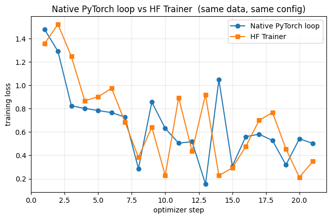
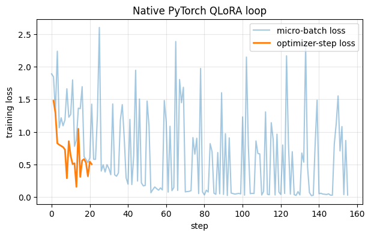

# 📈 Financial Research Agent

An AI agent that researches stocks and answers follow-up questions using live financial data, news, and SEC filings.

**Live Demo:** [financial-research-agent.streamlit.app](https://financial-research-agent.streamlit.app) | **Built with Claude Code**

---

## Why This Exists

I built this to answer a question I couldn't find a good answer to: *can an LLM agent produce investment briefs that are actually grounded in real sources -- and how would you even know?*

The answer required building both the agent and the measurement layer to audit it.

---

## What I Measured (and What I Found)

### Grounding Eval (LLM-as-judge)

I built an evaluation framework that audits every quantitative and forward-looking claim in each brief against the retrieved source context. A Sonnet judge (temperature 0) labels each claim `SUPPORTED`, `UNSUPPORTED`, or `INFERENCE`.

**Early results: 49% unsupported claim rate.** Nearly half of what the agent said wasn't backed by anything it retrieved.

After iterating on prompt constraints and forcing generation to stay grounded in source material: **3% unsupported claim rate.**

The prompt engineering work -- not the retrieval architecture -- was what actually moved the needle.

### Reranking A/B Experiment

I added optional cross-encoder reranking to the RAG pipeline and ran a controlled 4-arm eval across 10 tickers to measure whether it improved grounding:

| Arm | Claims | Grounding | Unsupported | Retrieval Latency |
|---|---:|---:|---:|---:|
| Baseline (top-3, no rerank) | 66 | 92.4% | 0.0% | 4.1s |
| Plain top-5 (no rerank) | 74 | 86.5% | 1.4% | 4.5s |
| Rerank 20→3 | 84 | 78.6% | 0.0% | 20.7s |
| Rerank 20→5 | 69 | 85.5% | 0.0% | 20.4s |

**Conclusion:** reranking adds 4--5x latency with no reliable grounding benefit. It ships default-off. The measurement framework is the deliverable -- it's what demonstrates the feature isn't needed, rather than assuming it would help.

### QLoRA Fine-Tuning Experiment

Can a small local model replace Claude Haiku on section generation at lower cost?

I fine-tuned **Qwen2.5-1.5B-Instruct** with QLoRA on 104 deterministic, Claude-free training pairs built from real SEC filings and financial data. The fine-tuned model serves 2 of 4 brief sections (Financial Health and Risk Factors); the other two stay on Haiku because deterministic targets couldn't be built for them -- an honest finding about the data, not a gap to paper over.

| | Cost per brief | Grounding |
|---|---:|---:|
| Baseline (all Haiku) | $0.00538 | 88.6% |
| Hybrid (local model for 2 sections) | $0.00248 | 85.4% |

**54% cost reduction at slightly lower grounding.** Shipped default-off -- the tradeoff isn't worth it for most users, but the benchmark is there for anyone who needs the cost savings.

I also re-implemented the same fine-tune with a hand-written PyTorch training loop (`fine_tune_pytorch_loop.ipynb`) -- custom `Dataset`, manual gradient accumulation and `optimizer.step()`, hand-written cosine LR, no Hugging Face `Trainer`. Benchmarked against the `Trainer` on identical data and config (`adamw_torch`, cosine schedule, grad-accum 8), the two loss curves track each other closely over 21 optimizer steps -- both start around 1.4--1.5 and trend down together, finishing at **0.50 (native)** and **0.35 (Trainer)**. The curves cross repeatedly, so that final-step gap sits within the run-to-run noise at this scale (~7 optimizer steps/epoch, plus shuffle order and 4-bit-kernel non-determinism) rather than a systematic difference -- confirming the hand-written loop reproduces the Trainer's training dynamics at the gradient-accumulation and optimizer-step level.





### Multi-Agent Orchestration Experiment

Does breaking the single agent into a supervisor-orchestrated team improve
grounding, or just add cost?

I refactored the brief pipeline into a supervisor graph: a **planner** decomposes
the ticker into SEC retrieval sub-questions and coverage points, a **research**
agent executes the plan against the existing RAG and model-routing code, an inline
**grounding-critic** scores the drafted brief with the same LLM-as-judge used by
the offline eval, and a **supervisor** sends the brief back for revision (bounded
at 2 passes) until it clears a grounding threshold. It is flag-gated behind
`MULTI_AGENT_ENABLED` (default off), with the original single-agent pipeline kept
as the A/B control. The inline critic and the offline judge share one definition,
so there is a single source of truth for grounding.

I ran both paths over the standard 10-ticker set, scored by the same
temperature-0 Sonnet judge, with retrieval held at baseline (reranking off, top-3)
on both sides so the only differences were the planner-driven queries and the
critic loop. Critic threshold: 5% unsupported.

| Path | Claims | Unsupported | $/brief | Latency/brief | Revisions/brief |
|---|---:|---:|---:|---:|---:|
| Single-agent (control) | 73 | 1 (1.4%) | $0.0269 | 26.1s | 0.00 |
| Multi-agent | 71 | 0 (0.0%) | $0.0515 | 43.9s | 0.00 |
| Delta | | -1.4 pts | +92% | +68% | n/a |

Two findings, stated plainly:

1. **The critic fired 0 revisions across all 10 real drafts.** The base pipeline
   already drives unsupported claims to roughly 3% overall and effectively 0 on the
   Executive Summary and Outlook sections this eval scores, so the critic looked at
   every first draft, found nothing to fix, and passed it. There was no headroom
   for the revision loop to recover.

2. **The one single-agent unsupported claim did not reproduce.** Across 73
   single-agent claims exactly one was flagged (on WMT). Re-running WMT produced a
   different draft with zero unsupported claims, confirming the lone flag was
   temperature-0.2 generation variance, not a systematic weakness in the base
   synthesis prompt.

The orchestration cost roughly **+92% per brief and +68% latency** (the planner
adds a Haiku call, and the inline critic adds a Sonnet judge to every brief) for a
grounding benefit that, on this workload, was null.

**Conclusion: it ships default-off.** On this workload the multi-agent path showed
no grounding benefit because the single-agent baseline was already at the
grounding floor, leaving nothing for the critic to recover. That is a statement
about this corpus, not a general claim about multi-agent orchestration. The
revision loop itself is verified working (an injected bad draft with a fabricated
price target is caught by the live judge, sent back, and cleaned on the second
pass); it is dormant in practice, not broken. The harness is retained to
re-measure if a harder corpus, thinner retrieval, a weaker base model, or longer
briefs ever create real grounding headroom. If that happens, a three-way
comparison (baseline / planner-only / planner+critic) is the documented next step
to attribute any gain to the planner versus the critic. As with the reranking
experiment, the deliverable is the measurement that shows when the feature is and
is not worth its cost.

---

## What It Does

**Generate Brief** -- enter a ticker and the app produces a structured investment brief:
1. Fetches stock data (yfinance), news (NewsAPI), and SEC filing summaries (EDGAR)
2. Runs two concurrent Pinecone RAG queries to ground the SEC Filing Highlights and Risk Factors sections in actual filing text
3. Generates four middle sections in parallel using Claude Haiku
4. Streams the Executive Summary and Outlook from Claude Sonnet, which receives the pre-written sections as context
5. Caches the completed brief in Redis (semantic similarity) and PostgreSQL

**Ask a follow-up** -- a LangGraph ReAct agent answers free-form questions, selecting whichever tools it needs (stock data, news, SEC filings, or RAG search).

---

## Tech Stack

| Layer | Technology |
|---|---|
| LLM -- section generation | Claude Haiku 4.5 (4 sections in parallel) |
| LLM -- synthesis + ReAct agent | Claude Sonnet 4.6 |
| Agent framework | LangGraph -- `create_react_agent` (follow-ups) + a supervisor `StateGraph` (optional multi-agent brief pipeline) |
| Financial data | yfinance |
| News | NewsAPI |
| SEC filings | SEC EDGAR REST API |
| SEC RAG | LlamaIndex + Pinecone + HuggingFace `bge-small-en-v1.5` |
| Reranking (optional) | Cross-encoder `BAAI/bge-reranker-base` |
| Observability | LangSmith (tool calls, tokens, latency, cost) |
| Semantic cache | Redis (cosine similarity on brief embeddings) |
| Persistence | PostgreSQL via SQLAlchemy |
| Async tasks | Celery + Redis |
| REST API | FastAPI |
| Frontend | Streamlit |
| Cloud (backend) | AWS ECS Fargate, RDS PostgreSQL, Secrets Manager, ECR |
| Infrastructure as Code | Terraform |
| CI/CD | GitHub Actions → ECR → ECS (OIDC, no static keys) |
| Development | Claude Code |

---

## Architecture

### Brief pipeline

```
"Generate Brief"
       │
       ▼
Redis semantic cache ──hit──► cached brief
       │ miss
       ▼
get_stock_data  (yfinance)
       │
       ▼
┌──────────────────┐  ┌─────────────────┐
│ get_company_news │  │ get_sec_filings  │  parallel
└──────────────────┘  └─────────────────┘
       │                       │
       └───────────┬───────────┘
                   │
       ┌───────────▼───────────┐
       │   Pinecone RAG (x2)   │  concurrent
       └───────────┬───────────┘
                   │
   ┌───────────────┼───────────────────┐
   ▼               ▼           ▼       ▼
Haiku           Haiku       Haiku   Haiku    4 parallel calls
Financial       Recent      SEC     Risk
Health          Dev.        High.   Factors
   └───────────────┴───────────┴───────┘
                   │
       ┌───────────▼───────────┐
       │  Sonnet: Exec Summary │  streams to browser
       │  + Outlook            │
       └───────────────────────┘
```

### Follow-up questions

```
"Ask" (free-form question)
       │
       ▼
LangGraph ReAct agent (claude-sonnet-4-6)
  ├─ get_stock_data
  ├─ get_company_news
  ├─ get_sec_filings
  └─ query_sec_filing (Pinecone RAG)
       │
       ▼
     answer
```

### Multi-agent brief pipeline (optional, `MULTI_AGENT_ENABLED=true`)

The single-agent brief pipeline can be swapped for a supervisor-orchestrated
graph. It's off by default -- the single-agent path stays the production default
and the A/B control -- and produces the **same brief schema and API response**, so
nothing downstream changes. Toggle the flag to compare the two paths.

```
"Generate Brief"  (MULTI_AGENT_ENABLED=true)
       │
       ▼
   ┌─────────┐  decomposes the ticker into a research plan: the SEC RAG
   │ Planner │  sub-questions that ground the filing-based sections + coverage
   └────┬────┘
        ▼
   ┌──────────┐ ◄──── revise (critic feedback prepended to the synthesis prompt)
   │ Research │  reuses the EXISTING retrieval + model-routing + synthesis code;
   └────┬─────┘  revision passes re-synthesise Exec Summary + Outlook only
        ▼
   ┌──────────────────┐  the existing LLM-as-judge, promoted to an inline node --
   │ Grounding-critic │  scores the draft for source-grounding (one judge, shared
   └────┬─────────────┘  with the offline eval; `agent/grounding.py`)
        ▼
   ┌────────────┐  unsupported% ≤ CRITIC_MAX_UNSUPPORTED_PCT → done; else send
   │ Supervisor │  back to Research, bounded at MAX_REVISIONS passes
   └────┬───────┘
        ▼
   final brief
```

- **One judge, two callers.** The inline critic and the offline grounding eval
  both call `agent/grounding.py:grade_brief()` -- there's a single definition of
  the judge prompt and scoring, not two copies that can drift.
- **Schema-safe revisions.** Revision passes reuse the already-grounded middle
  sections and only re-write the Executive Summary + Outlook through the same
  `_synthesis_prompt`, so the brief format can't break.
- **Bounded loop.** `MAX_REVISIONS` (default 2) caps the critic→research retries;
  the supervisor accepts the best effort if the budget is exhausted.
- **Tracing.** Each node (planner / research / critic / supervisor) is its own
  LangSmith span.

---

## AWS Deployment

The FastAPI backend is containerized and runs on **AWS ECS Fargate**, with a real
**RDS PostgreSQL** database, secrets in **AWS Secrets Manager**, and a
**GitHub Actions** pipeline that deploys on every push to `main`. The whole
footprint is defined in **Terraform** (`infra/`). The Streamlit frontend stays on
Streamlit Cloud; Redis/Celery are stubbed in this environment (the cache no-ops
and the async endpoint is disabled).

```
push to main
     │
     ▼
GitHub Actions ──OIDC (no long-lived AWS keys)──► assume scoped IAM role
  1. pytest (CI gate)
  2. docker build → push image (latest + commit SHA) → Amazon ECR
  3. register new task-def revision → update ECS service (wait for stable)
     │
     ▼
ECS Fargate task  (public subnet, public IP, security group locked to my IP)
  FastAPI container (uvicorn, single worker; bge-small model baked into image)
     │                                   │
     ▼                                   ▼
RDS PostgreSQL (t3.micro)        Secrets Manager
  research_briefs table            ANTHROPIC / NEWS / PINECONE / LANGSMITH keys,
  (private, SG-locked to           DATABASE_URL, REDIS_URL — injected as task
   the task's SG)                  env vars by the execution role
```

**Design choices**

- **Terraform, end to end** — ECR, RDS, Secrets Manager, IAM roles, security
  groups, the ECS cluster/task-def/service, and the GitHub OIDC provider are all
  in `infra/`. Local state; `terraform.tfvars` (with my IP) is gitignored.
- **No static cloud credentials** — GitHub Actions authenticates via **OIDC**,
  assuming a repo-scoped IAM role with just enough permission to push to ECR and
  deploy the service. Nothing long-lived is stored in the repo.
- **Secrets never in the image or git** — they live in Secrets Manager and are
  injected into the task as environment variables at runtime via the execution
  role.
- **Cost-aware** — RDS `t3.micro` on the free tier; Fargate runs in a **public
  subnet with a public IP (no NAT gateway)** to avoid NAT cost; the task's
  security group is locked to a single IP, so the unauthenticated API isn't open
  to the world.
- **Image** — `python:3.13-slim` with the embedding model baked in so cold start
  doesn't hit the HuggingFace Hub; built in CI (no local Docker needed).

### Pausing to save cost

Fargate bills while a task runs, so I park it when I'm not demoing and bring it
back for an interview:

```bash
infra/ecs-scale.sh 0   # pause  — stop the task (no Fargate compute cost; RDS stays free-tier)
infra/ecs-scale.sh 1   # resume — launch a fresh task (~1-2 min to start)
infra/ecs-ip.sh        # print the running task's public IP + base URL
```

Or the raw one-liner:

```bash
aws ecs update-service --cluster financial-agent-cluster --service financial-agent-api \
  --desired-count 1 --region us-east-1     # 0 to pause
```

There's no load balancer, so the task gets a **new public IP** on each resume
(`infra/ecs-ip.sh` fetches it). The service ignores `desired_count` in Terraform,
so scaling this way doesn't fight `terraform apply`.

See [`infra/README.md`](infra/README.md) for the apply steps.

---

## Running Locally

**1. Clone and install**
```bash
git clone https://github.com/schen9999/financial-agent.git
cd financial-agent
pip install -r requirements.txt
```

**2. Add API keys** -- copy `.env.example` to `.env`:

| Key | Where to get it |
|---|---|
| `ANTHROPIC_API_KEY` | [console.anthropic.com](https://console.anthropic.com) |
| `NEWS_API_KEY` | [newsapi.org](https://newsapi.org) |
| `REDIS_URL` | [upstash.com](https://upstash.com) (free tier) |
| `DATABASE_URL` | PostgreSQL connection string |
| `PINECONE_API_KEY` | [pinecone.io](https://pinecone.io) (free tier) |

**3. Run**
```bash
streamlit run app.py
```

---

## API Endpoints

| Method | Endpoint | Description |
|---|---|---|
| `GET` | `/health` | Health check |
| `POST` | `/research` | Generate brief (synchronous) |
| `POST` | `/research/async` | Submit research job |
| `GET` | `/research/status/{job_id}` | Poll async job status |
| `POST` | `/ask` | ReAct agent answer |
| `GET` | `/history/{ticker}` | Past briefs for a ticker |

---

## MCP Server

The agent's tools are also exposed over the **Model Context Protocol** via the
official `mcp` Python SDK (FastMCP), so any MCP client (Claude Desktop, the MCP
Inspector, etc.) can call the financial tools over the protocol. This is
**standalone and additive**: `mcp_server.py` reuses the existing LangChain tools
(no duplicated logic) and touches nothing in the FastAPI app, the Streamlit UI,
or the agent.

Tools exposed:

| MCP tool | Args | Returns |
|---|---|---|
| `get_stock_data` | `ticker` | price, market cap, P/E, revenue, margins, company info |
| `get_price_history` | `ticker` | 12 months of daily closes + percent change |
| `get_company_news` | `company_name` | 5 most recent news articles |
| `get_sec_filings` | `ticker` | latest 10-K / 10-Q summaries from EDGAR |
| `query_sec_filings` | `ticker`, `question` | RAG answer over indexed 10-K / 10-Q text (Pinecone) |

**Run it**

```bash
pip install "mcp[cli]==1.28.0"      # already in requirements.txt

mcp dev mcp_server.py               # launches the MCP Inspector over stdio (best for a quick demo)
python mcp_server.py                # raw stdio transport (what Claude Desktop launches)
MCP_TRANSPORT=streamable-http python mcp_server.py   # HTTP transport instead of stdio
```

**Connect Claude Desktop** -- add to `claude_desktop_config.json` (use absolute
paths to this repo's venv Python and `mcp_server.py`), then restart Claude Desktop:

```json
{
  "mcpServers": {
    "financial-research-agent": {
      "command": "/abs/path/financial-agent/.venv/Scripts/python.exe",
      "args": ["/abs/path/financial-agent/mcp_server.py"]
    }
  }
}
```

**Notes**

- **stdout hygiene (spec compliance).** On stdio, stdout is the JSON-RPC channel,
  so each tool body runs under `redirect_stdout(sys.stderr)`. The transport
  captures the real stdout once at startup, so library prints (e.g. the RAG
  pipeline's `[rag] ...` lines) go to stderr and never corrupt the protocol.
- **Windows event-loop fix.** On Windows the server forces the asyncio
  `SelectorEventLoop` (set at import, before any asyncio/anyio machinery loads).
  The default `ProactorEventLoop` makes native-extension HTTP backends -- notably
  yfinance's `curl_cffi`/libcurl and the torch/HuggingFace RAG stack -- hang when
  a tool runs in FastMCP's worker thread over stdio. No effect off Windows.
- **Cold start ~13s**, dominated by the LangChain import the reused tools pull in.
  The heavy RAG stack (LlamaIndex + Pinecone + the embedding model) is imported
  lazily inside `query_sec_filings`, so it only loads when that tool is first
  called and the server starts (and runs the other four tools) without a
  `PINECONE_API_KEY`.
- **Per-call timeout.** The reused tools have no request timeout, so a
  throttled/slow upstream (yfinance, SEC, NewsAPI) would hang the server. Each
  call is bounded at the wrapper layer by `MCP_TOOL_TIMEOUT` (default 30s) and
  fails into the tools' existing `{"error": ...}` shape. Raise it if the heavy
  first RAG call (model load + indexing) needs longer.
- Tools need the same keys as the rest of the app (`NEWS_API_KEY` for news,
  `PINECONE_API_KEY` for RAG); they are read from `.env`.

---

## Disclaimer

For informational purposes only. Does not constitute financial advice.