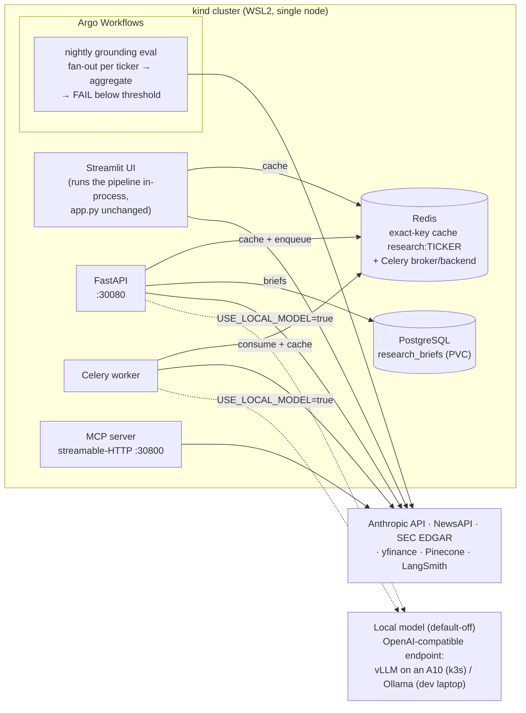

# 📈 Financial Research Agent

An AI agent that researches stocks and answers follow-up questions using live financial data, news, and SEC filings.

**Live Demo:** [financial-research-agent.streamlit.app](https://financial-research-agent.streamlit.app) | **Built with Claude Code**

**Documentation:** start at [docs/README.md](docs/README.md) — every question a reviewer might ask, mapped to the document that answers it.

---

## Summary

A research agent that turns live market data, news, and SEC filings into
investment briefs, and audits the quantitative and forward-looking claims in
each brief's Executive Summary and Outlook against the sources it retrieved,
using an LLM judge whose own accuracy is measured against blind human labels. It runs as a six-service stack (FastAPI, Celery,
Redis, PostgreSQL, Streamlit, MCP server) on Kubernetes, with the grounding
eval as a gated Argo Workflows DAG. On OCI it runs on single-node k3s on A10
GPU VMs, where vLLM serves a QLoRA fine-tune that was measured against the
hosted models and ships disabled. Every rate this repository quotes names its
judge version and the run or source it came from, with a Wilson confidence
interval wherever the claim counts are on record.

---

## Deployed on OCI

- **Where:** two VM.GPU.A10.1 instances (1x A10 24 GB, Ubuntu 22.04):
  `vm-a10-inst-1` (the demo target) and `vm-a10-inst-2` (fallback), each a
  separate single-node k3s cluster, rebuilt from the runbook on 2026-09-23.
  They are reached only through ssh tunnels; the VCN security list admits
  port 22 only.
- **What runs there:** the six services; vLLM v0.10.2 serving the merged
  fine-tune (`financial-lora`) on the node's A10, behind the default-off
  `USE_LOCAL_MODEL` flag; and Argo Workflows running the gated grounding-eval
  DAG (the nightly CronWorkflow is suspended on k3s; runs are submitted with
  `make vm-eval`).
- **One manifest set:** a kustomize base with `kind`, `k3s`, and `oke`
  overlays; `scripts/render_diff.py` proves overlay changes never alter the
  kind render ([docs/verification.md](docs/verification.md)).
- **OKE:** Terraform for an OKE basic cluster, both node pools (including an
  A10 GPU pool), OCIR, an Object Storage bucket, and a Block Volume storage
  class is written and passes `terraform validate`, but has **never been
  applied**. The k3s VMs are the running target.
- **How to deploy it:** [docs/operations.md](docs/operations.md) (current
  procedure, teardown, troubleshooting); [docs/deploy-runbook.md](docs/deploy-runbook.md)
  is the dated history and the OKE steps. Configuration:
  [docs/configuration.md](docs/configuration.md); cost: [docs/cost.md](docs/cost.md).

## Key results

Every row links to [docs/numbers-of-record.md](docs/numbers-of-record.md),
which carries the full records and the rules for quoting them. Judge-v2
rates are judge-flagged rates. Held-out calibration: precision 60% (9/15, CI 35.7–80.2%); population-weighted recall ~25% on the baseline run (CI 7.4–58.4%), driven by one miss in 20 judge-SUPPORTED claims, so the interval is wide; the baseline's
reweighted true-rate estimate 7.2% (CI 3.1–22.0%).

| Result | Value (Wilson 95% CI) | Run ID / source | Judge | Status |
|---|---|---|---|---|
| Grounding, hosted pipeline (40 tickers) | 12/392 = 3.06% unsupported (1.8–5.3%) | `j4cnp`, 2026-09-05/06 | v2 | [number of record](docs/numbers-of-record.md#current) |
| Fine-tune vs hosted (40-ticker A/B) | 30/368 = 8.15% (5.8–11.4%) vs 12/392 = 3.06% (1.8–5.3%), Fisher p = 0.0023 — fails the 5% gate, ships disabled | `lsnnc` vs `j4cnp`, 2026-09-05/06 | v2 | [dated record](docs/numbers-of-record.md#dated-run-records) |
| Four-arm comparison (40 tickers) | hosted 4/383 = 1.04% (0.4–2.7%); fine-tune 25/385 = 6.49% (4.4–9.4%); untuned Qwen2.5-1.5B 31/400 = 7.75% (5.5–10.8%); untuned Qwen2.5-7B 18/393 = 4.58% (2.9–7.1%) | `kcf7s`, `v924f`, `4nfsm`, `cnkp2`, 2026-09-23 | v2 | [dated comparison set, not numbers of record](docs/numbers-of-record.md#dated-run-records) |
| Judge validation (blind, held-out, n=50) | kappa 0.580; UNSUPPORTED precision 9/15 = 60.0% (35.7–80.2%), population-weighted recall 25.4% on `j4cnp` (7.4–58.4%) | `eval/judge_validation/holdout_sample.csv`, labeled 2026-09-06 | v2 | [current](docs/numbers-of-record.md#current) |
| Cost per brief | $0.0366 (3-ticker mean; no interval computed) | `cost_record_post_fix.json`, 2026-09-06 | n/a (not a judged rate) | [cost of record](docs/numbers-of-record.md#current) |

---

## What It Does

**Generate Brief** -- enter a ticker and the app produces a structured investment brief:
1. Fetches stock data (yfinance), news (NewsAPI), and SEC filing summaries (EDGAR)
2. Runs two concurrent Pinecone RAG queries to ground the SEC Filing Highlights and Risk Factors sections in actual filing text (a retrieval defect that indexed exhibit text instead of Item 1A for most tickers was found and fixed 2026-09-04 — see [docs/eval-methodology.md](docs/eval-methodology.md), "Retrieval defect")
3. Generates four middle sections in parallel using Claude Haiku
4. Streams the Executive Summary and Outlook from Claude Sonnet, which receives the pre-written sections as context
5. Caches the completed brief in Redis (exact key `research:{TICKER}`) and PostgreSQL

**Ask a follow-up** -- a LangGraph ReAct agent answers free-form questions, selecting whichever tools it needs (stock data, news, SEC filings, or RAG search).

**Two execution paths, by design:** the Streamlit UI imports the agent and runs the pipeline **in-process** (so the hosted demo needs no backend and can stream tokens directly), while the FastAPI app runs the same `agent/` code behind REST endpoints for programmatic consumers (and is what ECS/Kubernetes deploy). Same pipeline, two entry points -- there is no Streamlit→FastAPI hop.

---

## Why This Exists

I built this to answer a question I couldn't find a good answer to: *can an LLM agent produce investment briefs that are actually grounded in real sources -- and how would you even know?*

The answer required building both the agent and the measurement layer to audit it.

---

## What I Measured (and What I Found)

### Grounding Eval (LLM-as-judge)

I built an evaluation framework that audits the quantitative and forward-looking claims in each brief's Executive Summary and Outlook against the retrieved source context (the four pre-written sections are judge input, not audited directly). A Sonnet judge (temperature 0) labels each claim `SUPPORTED`, `UNSUPPORTED`, or `INFERENCE`.

**Early results: 49% unsupported claim rate (judge v1, pre-retrieval-fix).** Nearly half of what the agent said wasn't backed by anything it retrieved.

After iterating on prompt constraints and forcing generation to stay grounded in source material, the 2026-08-24 10-ticker re-measure found 0/84 unsupported — a dated record (judge v1, a lower bound; pre-retrieval-fix). The current grounding number of record is the 40-ticker hosted baseline `j4cnp` (2026-09-05/06): **12/392 = 3.06% unsupported (Wilson 95% CI 1.8–5.3%)**, judge v2 on the fixed retrieval pipeline. That is the judge-flagged rate; the reweighted true-rate estimate 7.2% (CI 3.1–22.0%). Held-out calibration (blind labels, n=50): precision 60% (9/15, CI 35.7–80.2%); population-weighted recall ~25% on the baseline run (CI 7.4–58.4%), driven by one miss in 20 judge-SUPPORTED claims, so the interval is wide. See [docs/numbers-of-record.md](docs/numbers-of-record.md).

*Judge-version note:* every unsupported rate in this README names its judge prompt version. **v1** rates are lower bounds (2026-09-04 human validation: v1 recall on UNSUPPORTED 1/9). **v2** rates are judge-flagged rates and carry the held-out calibration (blind human labels, n=50, 2026-09-06): kappa 0.580, precision 60% (9/15, CI 35.7–80.2%); population-weighted recall ~25% on the baseline run (CI 7.4–58.4%), driven by one miss in 20 judge-SUPPORTED claims, so the interval is wide. Reweighted true-rate estimates sit beside the rates where computed; A/B directions are unaffected when both arms share the judge ([docs/eval-methodology.md](docs/eval-methodology.md)).

The prompt engineering work -- not the retrieval architecture -- was what actually moved the needle.

### Reranking A/B Experiment

I added optional cross-encoder reranking to the RAG pipeline and ran a controlled 4-arm eval across 10 tickers to measure whether it improved grounding. A dated record: Jun 2026, judge v1, pre-retrieval-fix, local `grounding_check.py` runs (pre-Argo, so no workflow run IDs); intervals from `eval/stats.py`:

| Arm | Claims | Grounding | Unsupported (judge v1, Wilson 95% CI) | Retrieval Latency |
|---|---:|---:|---:|---:|
| Baseline (top-3, no rerank) | 66 | 92.4% | 0/66 = 0.0% (0.0–5.5%) | 4.1s |
| Plain top-5 (no rerank) | 74 | 86.5% | 1/74 = 1.4% (0.2–7.3%) | 4.5s |
| Rerank 20→3 | 84 | 78.6% | 0/84 = 0.0% (0.0–4.4%) | 20.7s |
| Rerank 20→5 | 69 | 85.5% | 0/69 = 0.0% (0.0–5.3%) | 20.4s |

**Conclusion:** reranking adds 4--5x retrieval latency with no reliable grounding benefit. It ships default-off. The measurement framework is the deliverable -- it's what demonstrates the feature isn't needed, rather than assuming it would help.

### QLoRA Fine-Tuning Experiment

Can a small local model replace Claude Haiku on section generation at lower cost?

I fine-tuned **Qwen2.5-1.5B-Instruct** with QLoRA on 104 deterministic, Claude-free training pairs built from real SEC filings and financial data. When enabled, the fine-tuned model is routed 2 of 4 brief sections (Financial Health and Risk Factors); the other two stay on Haiku because deterministic targets couldn't be built for them -- an honest finding about the data, not a gap to paper over. **The measured verdict (2026-09-05/06, 40-ticker in-cluster A/B, judge v2, same image and index): the fine-tune fails the 5% grounding gate -- 8.15% unsupported (`lsnnc`, 30/368, Wilson 95% CI 5.8–11.4%) vs a 3.06% hosted baseline (`j4cnp`, 12/392, CI 1.8–5.3%), Fisher p = 0.0023 -- and the failure concentrates in exactly the two sections it owns (19.82%, 22/111, CI 13.5–28.2%, vs 0.50%, 1/202, CI 0.1–2.8%, on attributed claims; same two runs), so it ships default-off.** These are judge-flagged v2 rates; reweighted true-rate estimates are 9.8% (CI 5.3–24.2%) vs 7.2% (CI 3.1–22.0%), and the direction stands because both arms share the judge. The rest of this section is the experiment record.

**No measurable full-brief cost reduction.** Measured with the committed cost
harness (`scripts/cost_report.py`; details in [benchmarks.md](benchmarks.md)),
Sonnet synthesis dominates the bill: hosted $0.0316/brief vs hybrid
$0.0321/brief (both on the pre-retrieval-fix pipeline; the current cost of
record is **$0.0366/brief**, 2026-09-06 post-retrieval-fix) -- the saving on
the two local sections is within run-to-run variance. Shipped default-off.

**Aug 2026 re-measure ([benchmarks.md](benchmarks.md)):** the grounding
regression reproduced in direction -- grounding (supported share) 86.2% hosted
(56/65, Wilson 95% CI 75.7–92.5%) vs 77.8% hybrid (56/72, CI 66.9–85.8%);
judge v1, 9 tickers balanced, pre-retrieval-fix, local `grounding_check.py`
run with no workflow run ID. The local model runs behind a pluggable OpenAI-compatible backend
(`LOCAL_MODEL_BACKEND=openai`); on this AVX2-only dev CPU the prebuilt vLLM
image SIGILLs (root-caused to its AVX-512 requirement), so locally the code
path is exercised via Ollama's `/v1` endpoint.

**Sep 2026 GPU serving + in-cluster A/B:** vLLM v0.10.2 served the merged
fine-tune pinned to one A10 on an OCI VM -- plain Docker (2026-09-02), then
in-cluster on single-node k3s (2026-09-03) -- and the gated eval DAG ran a
40-ticker A/B against it (2026-09-05/06, judge v2, same image and index both
arms): **8.15% unsupported (`lsnnc`, 30/368, CI 5.8–11.4%) vs the hosted
baseline 3.06% (`j4cnp`, 12/392, CI 1.8–5.3%), Fisher p = 0.0023** -- the
local-model arm fails the 5% gate, the hosted baseline passes, and
per-section attribution places the excess entirely in the two
fine-tune-owned sections (**19.82%, 22/111, CI 13.5–28.2% vs 0.50%, 1/202,
CI 0.1–2.8%**, p = 4.6e-10). An earlier 10-ticker pass agreed in direction
but could not separate the arms (dated records in
[docs/eval-methodology.md](docs/eval-methodology.md)). A measured negative
result, and the reason `USE_LOCAL_MODEL` ships off.

**Four-arm comparison (2026-09-23, a dated comparison set, not numbers of
record; 40 tickers, judge v2, identical pinned sampling).** To separate
training from model size, the same harness scored four arms that differ
only in who writes Financial Health and Risk Factors: each local model
writes those two sections, while Haiku writes the other two and Sonnet the
synthesis in every arm. Unsupported rates: the hosted baseline (`kcf7s`,
4/383 = 1.04%, CI 0.4–2.7%), the fine-tune (`v924f`, 25/385 = 6.49%, CI 4.4–9.4%), its
untuned base Qwen2.5-1.5B-Instruct (`4nfsm`, 31/400 = 7.75%, CI 5.5–10.8%),
and untuned Qwen2.5-7B-Instruct (`cnkp2`, 18/393 = 4.58%, CI 2.9–7.1%). The
fine-tune matched its own base (p = 0.58); within Qwen2.5, 1.5B → 7B
improved with borderline significance (p = 0.076) at 3.7x lower serving
throughput on the same A10; and every open-weight arm trailed hosted (7B vs
hosted p = 0.0039). Judge-flagged v2 rates; comparisons hold in
direction because all arms share the judge. Details: [docs/eval-methodology.md](docs/eval-methodology.md).

I also re-implemented the same fine-tune with a hand-written PyTorch training loop (`fine_tune_pytorch_loop.ipynb`) -- custom `Dataset`, manual gradient accumulation and `optimizer.step()`, hand-written cosine LR, no Hugging Face `Trainer`. Benchmarked against the `Trainer` on identical data and config (`adamw_torch`, cosine schedule, grad-accum 8), the two loss curves track each other closely over 21 optimizer steps -- both start around 1.4--1.5 and trend down together, finishing at **0.50 (native)** and **0.35 (Trainer)**. The curves cross repeatedly, so that final-step gap sits within the run-to-run noise at this scale (~7 optimizer steps/epoch, plus shuffle order and 4-bit-kernel non-determinism) rather than a systematic difference -- confirming the hand-written loop reproduces the Trainer's training dynamics at the gradient-accumulation and optimizer-step level.


### Multi-Agent Orchestration Experiment

Does breaking the single agent into a supervisor-orchestrated team improve
grounding, or just add cost?

I refactored the brief pipeline into a supervisor graph: a **planner** decomposes
the ticker into SEC retrieval sub-questions and coverage points, a **research**
agent executes the plan against the existing RAG and model-routing code, an inline
**grounding-critic** scores the drafted brief with the same LLM-as-judge used by
the offline eval, and a **supervisor** sends the brief back for revision (bounded
at 2 passes) until it clears a grounding threshold. It is flag-gated behind
`MULTI_AGENT_ENABLED` (default off), with the original single-agent pipeline kept
as the A/B control. The inline critic and the offline judge share one definition,
so there is a single source of truth for grounding.

I ran both paths over the standard 10-ticker set, scored by the same
temperature-0 Sonnet judge, with retrieval held at baseline (reranking off, top-3)
on both sides so the only differences were the planner-driven queries and the
critic loop. Critic threshold: 5% unsupported. A dated record: Jun 2026,
judge v1, pre-retrieval-fix, local runs (pre-Argo, no workflow run IDs);
intervals from `eval/stats.py`.

| Path | Claims | Unsupported (judge v1, Wilson 95% CI) | Latency/brief | Revisions/brief |
|---|---:|---:|---:|---:|
| Single-agent (control) | 73 | 1/73 = 1.4% (0.2–7.4%) | 26.1s | 0.00 |
| Multi-agent | 71 | 0/71 = 0.0% (0.0–5.1%) | 43.9s | 0.00 |
| Delta | | -1.4 pts | +68% | n/a |

The multi-agent path also costs more per brief (an extra Haiku planner call
and a Sonnet critic call on every brief). The cost ratio this experiment
recorded came from an uncommitted harness, so it is kept only as a historical
note in [docs/PHASE0_AUDIT.md](docs/PHASE0_AUDIT.md) and not quoted here; the
current re-runnable cost of record for the single-agent pipeline is
**$0.0366/brief** (2026-09-06, post-retrieval-fix; `scripts/cost_report.py`).

Two findings, stated plainly:

1. **The critic fired 0 revisions across all 10 real drafts.** The base pipeline
   already drives unsupported claims to the floor (1/73 on the control arm
   above; a later re-measure on 2026-08-24 found 0/84, Wilson 95% CI
   0.0–4.4%, judge v1, pre-retrieval-fix, local run with no workflow run ID) on the
   Executive Summary and Outlook sections this eval scores, so the critic looked at
   every first draft, found nothing to fix, and passed it. There was no headroom
   for the revision loop to recover.

2. **The one single-agent unsupported claim did not reproduce.** Across 73
   single-agent claims exactly one was flagged (on WMT). Re-running WMT produced a
   different draft with zero unsupported claims, confirming the lone flag was
   temperature-0.2 generation variance, not a systematic weakness in the base
   synthesis prompt.

The orchestration adds cost and latency (the planner adds a Haiku call, and the
inline critic adds a Sonnet judge to every brief) for a grounding benefit that,
on this workload, was null.

**Conclusion: it ships default-off.** On this workload the multi-agent path showed
no grounding benefit because the single-agent baseline was already at the
grounding floor, leaving nothing for the critic to recover. That is a statement
about this corpus, not a general claim about multi-agent orchestration. The
revision loop itself is verified working (an injected bad draft with a fabricated
price target is caught by the live judge, sent back, and cleaned on the second
pass); it is dormant in practice, not broken. The harness is retained to
re-measure if a harder corpus, thinner retrieval, a weaker base model, or longer
briefs ever create real grounding headroom. If that happens, a three-way
comparison (baseline / planner-only / planner+critic) is the documented next step
to attribute any gain to the planner versus the critic. As with the reranking
experiment, the deliverable is the measurement that shows when the feature is and
is not worth its cost.

---

## Tech Stack

| Layer | Technology |
|---|---|
| LLM -- section generation | Claude Haiku 4.5 (4 sections in parallel) |
| LLM -- synthesis + ReAct agent | Claude Sonnet 4.6 |
| Agent framework | LangGraph -- `create_react_agent` (follow-ups) + a supervisor `StateGraph` (optional multi-agent brief pipeline) |
| Financial data | yfinance |
| News | NewsAPI |
| SEC filings | SEC EDGAR REST API |
| SEC RAG | LlamaIndex + Pinecone + HuggingFace `bge-small-en-v1.5` |
| Reranking (optional) | Cross-encoder `BAAI/bge-reranker-base` |
| Observability | LangSmith (tool calls, tokens, latency, cost) |
| Brief cache | Redis (exact key per ticker, `research:{TICKER}`) |
| Persistence | PostgreSQL via SQLAlchemy |
| Async tasks | Celery + Redis |
| REST API | FastAPI |
| Frontend | Streamlit |
| Orchestration | Kubernetes — kind (local, single node in WSL2) and single-node k3s on two OCI A10 VMs; full topology incl. worker + MCP |
| Batch / eval orchestration | Argo Workflows v3.7 (fan-out eval DAG, nightly CronWorkflow, quality gate) |
| Local model serving (default-off) | OpenAI-compatible backend: vLLM v0.10.2 on one OCI A10 (k3s) / Ollama `/v1` on the dev laptop (no AVX-512 for vLLM) — see [benchmarks.md](benchmarks.md) |
| Cloud (backend) | AWS ECS Fargate, RDS PostgreSQL, Secrets Manager, ECR |
| Infrastructure as Code | Terraform |
| CI/CD | GitHub Actions → ECR → ECS (OIDC, no static keys) |
| Development | Claude Code |

---

## Architecture

### Deployment topology (Kubernetes)

The full designed topology runs on a single-node kind cluster locally and on
single-node k3s on the OCI A10 VMs (see [k8s/README.md](k8s/README.md),
[docs/deploy-runbook.md](docs/deploy-runbook.md), and the audit in
[docs/PHASE0_AUDIT.md](docs/PHASE0_AUDIT.md)). The diagram shows the kind
layout; the k3s overlay adds vLLM on the node's A10:



- **Celery vs. Argo:** request-time async stays on Celery; batch/eval runs on
  Argo (reasoning in the [Celery vs. Argo section](#kubernetes-and-the-celery-vs-argo-split)).
- **Eval pods** force `BYPASS_CACHE=true` and never touch the live cache.
- **Feature flags** are restated at their audited defaults in the ConfigMap;
  reranking, multi-agent, and the local model all ship off, each for a
  measured reason.

### Brief pipeline

```
"Generate Brief"
       │
       ▼
Redis cache (research:TICKER) ──hit──► cached brief
       │ miss
       ▼
get_stock_data  (yfinance)
       │
       ▼
┌──────────────────┐  ┌─────────────────┐
│ get_company_news │  │ get_sec_filings  │  parallel
└──────────────────┘  └─────────────────┘
       │                       │
       └───────────┬───────────┘
                   │
       ┌───────────▼───────────┐
       │   Pinecone RAG (x2)   │  concurrent
       └───────────┬───────────┘
                   │
   ┌───────────────┼───────────────────┐
   ▼               ▼           ▼       ▼
Haiku           Haiku       Haiku   Haiku    4 parallel calls
Financial       Recent      SEC     Risk
Health          Dev.        High.   Factors
   └───────────────┴───────────┴───────┘
                   │
       ┌───────────▼───────────┐
       │  Sonnet: Exec Summary │  streams to browser
       │  + Outlook            │
       └───────────────────────┘
```

### Follow-up questions

```
"Ask" (free-form question)
       │
       ▼
LangGraph ReAct agent (claude-sonnet-4-6)
  ├─ get_stock_data
  ├─ get_company_news
  ├─ get_sec_filings
  └─ query_sec_filing (Pinecone RAG)
       │
       ▼
     answer
```

### Multi-agent brief pipeline (optional, `MULTI_AGENT_ENABLED=true`)

The single-agent brief pipeline can be swapped for a supervisor-orchestrated
graph. It's off by default -- the single-agent path stays the production default
and the A/B control -- and produces the **same brief schema and API response**, so
nothing downstream changes. Toggle the flag to compare the two paths.

```
"Generate Brief"  (MULTI_AGENT_ENABLED=true)
       │
       ▼
   ┌─────────┐  decomposes the ticker into a research plan: the SEC RAG
   │ Planner │  sub-questions that ground the filing-based sections + coverage
   └────┬────┘
        ▼
   ┌──────────┐ ◄──── revise (critic feedback prepended to the synthesis prompt)
   │ Research │  reuses the EXISTING retrieval + model-routing + synthesis code;
   └────┬─────┘  revision passes re-synthesise Exec Summary + Outlook only
        ▼
   ┌──────────────────┐  the existing LLM-as-judge, promoted to an inline node --
   │ Grounding-critic │  scores the draft for source-grounding (one judge, shared
   └────┬─────────────┘  with the offline eval; `agent/grounding.py`)
        ▼
   ┌────────────┐  unsupported% ≤ CRITIC_MAX_UNSUPPORTED_PCT → done; else send
   │ Supervisor │  back to Research, bounded at MAX_REVISIONS passes
   └────┬───────┘
        ▼
   final brief
```

- **One judge, two callers.** The inline critic and the offline grounding eval
  both call `agent/grounding.py:grade_brief()` -- there's a single definition of
  the judge prompt and scoring, not two copies that can drift.
- **Schema-safe revisions.** Revision passes reuse the already-grounded middle
  sections and only re-write the Executive Summary + Outlook through the same
  `_synthesis_prompt`, so the brief format can't break.
- **Bounded loop.** `MAX_REVISIONS` (default 2) caps the critic→research retries;
  the supervisor accepts the best effort if the budget is exhausted.
- **Tracing.** Each node (planner / research / critic / supervisor) is its own
  LangSmith span.

---

## AWS Deployment (secondary)

The primary deployment is on OCI ([above](#deployed-on-oci)). AWS ECS is a secondary, single-container deployment of the API only.

The FastAPI backend is containerized and runs on **AWS ECS Fargate**, with a real
**RDS PostgreSQL** database, secrets in **AWS Secrets Manager**, and a
**GitHub Actions** pipeline that deploys after CI passes on `main` (commits
that touch only `README.md`, `docs/`, `infra/`, or notebooks skip the deploy). The whole
footprint is defined in **Terraform** (`infra/`). The Streamlit frontend stays on
Streamlit Cloud; Redis/Celery are stubbed in this environment (the cache no-ops
and the async endpoint is disabled).

```
push to main
     │
     ▼
GitHub Actions ──OIDC (no long-lived AWS keys)──► assume scoped IAM role
  1. pytest (CI gate)
  2. docker build → push image (latest + commit SHA) → Amazon ECR
  3. register new task-def revision → update ECS service (wait for stable)
     │
     ▼
ECS Fargate task  (public subnet, public IP, security group locked to my IP)
  FastAPI container (uvicorn, single worker; bge-small model baked into image)
     │                                   │
     ▼                                   ▼
RDS PostgreSQL (t3.micro)        Secrets Manager
  research_briefs table            ANTHROPIC / NEWS / PINECONE / LANGSMITH keys,
  (private, SG-locked to           DATABASE_URL, REDIS_URL — injected as task
   the task's SG)                  env vars by the execution role
```

**Current state.** The service normally runs at 0 tasks. It was last deployed
at `c602e99` (task definition revision 8) and verified on 2026-09-24 by
scaling to 1: `/health` returned 200 and an AAPL brief returned 200 with all
six sections, then the service was parked at 0 again. Two caveats: the task
definition has no container health check (Fargate ignores the image's
Dockerfile `HEALTHCHECK`), so ECS reports health as UNKNOWN; and at 0 tasks a
deploy's "wait for stable" passes without starting a container, so a deploy
alone doesn't prove the new image runs.

**Design choices**

- **Terraform, end to end** — ECR, RDS, Secrets Manager, IAM roles, security
  groups, the ECS cluster/task-def/service, and the GitHub OIDC provider are all
  in `infra/`. Local state; `terraform.tfvars` (with my IP) is gitignored.
- **No static cloud credentials** — GitHub Actions authenticates via **OIDC**,
  assuming a repo-scoped IAM role with just enough permission to push to ECR and
  deploy the service. Nothing long-lived is stored in the repo.
- **Secrets never in the image or git** — they live in Secrets Manager and are
  injected into the task as environment variables at runtime via the execution
  role.
- **Cost-aware** — RDS `t3.micro` on the free tier; Fargate runs in a **public
  subnet with a public IP (no NAT gateway)** to avoid NAT cost; the task's
  security group is locked to a single IP, so the unauthenticated API isn't open
  to the world.
- **Image** — `python:3.13-slim` with the embedding model baked in so cold start
  doesn't hit the HuggingFace Hub; built in CI (no local Docker needed).

### Pausing to save cost

Fargate bills while a task runs, so the service is parked at 0 tasks and scaled
up only when it's needed:

```bash
infra/ecs-scale.sh 0   # pause  — stop the task (no Fargate compute cost; RDS stays free-tier)
infra/ecs-scale.sh 1   # resume — launch a fresh task (~1-2 min to start)
infra/ecs-ip.sh        # print the running task's public IP + base URL
```

Or the raw one-liner:

```bash
aws ecs update-service --cluster financial-agent-cluster --service financial-agent-api \
  --desired-count 1 --region us-east-1     # 0 to pause
```

There's no load balancer, so the task gets a **new public IP** on each resume
(`infra/ecs-ip.sh` fetches it). The service ignores `desired_count` in Terraform,
so scaling this way doesn't fight `terraform apply`.

See [`infra/README.md`](infra/README.md) for the apply steps.

---

## Running Locally

**1. Clone and install**
```bash
git clone https://github.com/schen9999/financial-agent.git
cd financial-agent
pip install -r requirements.txt
```

**2. Add API keys** -- copy `.env.example` to `.env`:

| Key | Where to get it |
|---|---|
| `ANTHROPIC_API_KEY` | [console.anthropic.com](https://console.anthropic.com) |
| `NEWS_API_KEY` | [newsapi.org](https://newsapi.org) |
| `REDIS_URL` | [upstash.com](https://upstash.com) (free tier) |
| `DATABASE_URL` | PostgreSQL connection string |
| `PINECONE_API_KEY` | [pinecone.io](https://pinecone.io) (free tier) |

**3. Run**
```bash
streamlit run app.py
```

**Or run the full topology on Kubernetes** (Linux/WSL2 with docker + kind +
kubectl; see [k8s/README.md](k8s/README.md) for setup):

```bash
make cluster-up      # single-node kind cluster
make deploy          # build image, secrets from .env, deploy all six services
make smoke-test      # end-to-end: brief, Celery async, cache hit/miss, MCP, UI
make argo-install    # Argo Workflows (pinned v3.7.18)
make argo-deploy     # eval WorkflowTemplate + nightly CronWorkflow
make eval-run        # run the gated grounding eval now
make cluster-down    # tear down
```

### Benchmark summary (details + caveats in [benchmarks.md](benchmarks.md))

| Measurement | Result |
|---|---|
| Grounding, number of record (40 tickers, judge v2, fixed retrieval) | **12/392 = 3.06% unsupported (Wilson 95% CI 1.8–5.3%)**, hosted baseline `j4cnp` (2026-09-05/06); judge-flagged rate, reweighted true-rate estimate 7.2% (CI 3.1–22.0%) |
| Grounding, dated (2026-08-24, 10 tickers, judge v1, pre-retrieval-fix) | 49% pre-fix → 0/84 unsupported (CI 0.0–4.4%) — a lower bound on an exhibit-indexing pipeline; retired as current |
| Cost/brief, hosted (exact API tokens + RAG estimate) | **$0.0366** (2026-09-06, post-retrieval-fix; re-runnable: `make cost-report`) |
| Grounding (supported share), hosted vs local-hybrid (9-ticker balanced A/B, Aug 2026, judge v1, pre-retrieval-fix, local run — no workflow run ID) | 86.2% (56/65, CI 75.7–92.5%) vs 77.8% (56/72, CI 66.9–85.8%) — expected regression, local stays default-off |
| Grounding, hosted vs in-cluster vLLM fine-tune (40-ticker A/B, 2026-09-05/06, judge v2) | `j4cnp` 3.06% (12/392, CI 1.8–5.3%) vs `lsnnc` 8.15% (30/368, CI 5.8–11.4%) unsupported, Fisher p = 0.0023 — local-model arm fails the 5% gate; ships default-off. Per-section: 0.50% (1/202, CI 0.1–2.8%) vs 19.82% (22/111, CI 13.5–28.2%) on fine-tune-owned claims (p = 4.6e-10). Judge-flagged rates; reweighted true-rate estimates 7.2% vs 9.8%, direction unaffected (same judge); see [docs/eval-methodology.md](docs/eval-methodology.md) |
| Four-arm comparison (2026-09-23, 40 tickers, judge v2, identical pinned sampling) — a dated comparison set, not numbers of record | Unsupported: hosted `kcf7s` 1.04% (4/383, CI 0.4–2.7%); fine-tune `v924f` 6.49% (25/385, CI 4.4–9.4%); untuned Qwen2.5-1.5B `4nfsm` 7.75% (31/400, CI 5.5–10.8%); untuned Qwen2.5-7B `cnkp2` 4.58% (18/393, CI 2.9–7.1%). Fine-tune vs its base p = 0.58; 1.5B vs 7B p = 0.076 (borderline); 7B vs hosted p = 0.0039 |
| Judge v2 held-out validation (blind, n=50, 2026-09-06) | kappa 0.580; UNSUPPORTED precision 60.0% (35.7–80.2%), population-weighted recall 25.4% on `j4cnp` (7.4–58.4%); v2 rates are judge-flagged rates |
| Critic recall on injected failures | 20/20 = 100% (CI 83.9–100%) on both runs (2026-09-04); adjudicated precision 24/24 |
| Cost/brief, hosted vs local-hybrid (pre-retrieval-fix pipeline) | $0.0316 vs $0.0321 — no measurable full-brief saving (Sonnet dominates) |
| Local CPU serving (environment-limited: 2-core AVX2 laptop) | ~7.7 tok/s aggregate saturation; NOT comparable to GPU/hosted |

---

## Testing

| What | Command | Notes |
|---|---|---|
| Unit and integration tests | `python -m pytest tests/` | 139 collected: 138 pass + 1 skipped (as of 2026-09-24). Runs in CI on every pull request and push to `main`. |
| Credit-gated judge test | `CRITIC_INJECTION=1 python -m pytest tests/test_critic_injection.py -q -s` | Calls the paid Sonnet judge, so it is skipped in the default run and never runs on push or PR. `critic-injection.yml` runs it weekly and on manual dispatch and asserts recall ≥ 0.8. |
| Kubernetes smoke test | `make smoke-test` | On kind: 13 assertions covering a sync brief, a Celery async task, a cache hit and miss, and the MCP server. |
| Manifest equivalence | `python3 scripts/render_diff.py LEFT RIGHT` | Semantic diff of two rendered manifest sets; exit 0 means identical. How it proves the overlays: [docs/verification.md](docs/verification.md). |
| Grounding eval gate | `make eval-run` (kind) / `make vm-eval` (k3s) | The Argo DAG fails the workflow if unsupported claims exceed 5%, any ticker is skipped, or fewer than 30 claims were audited. |

---

## API Endpoints

Full reference with request and response shapes and an example for each
route: [docs/api.md](docs/api.md). A running instance also serves the
generated reference at `/docs`.

| Method | Endpoint | Description |
|---|---|---|
| `GET` | `/health` | Health check |
| `GET` | `/stock/{ticker}` | Current quote and key financials |
| `GET` | `/stock/{ticker}/history` | 12 months of daily closes |
| `POST` | `/research` | Generate brief (synchronous) |
| `POST` | `/research/async` | Submit research job |
| `GET` | `/research/status/{job_id}` | Poll async job status |
| `POST` | `/ask` | ReAct agent answer |
| `GET` | `/history/{ticker}` | Past briefs for a ticker |
| `GET` | `/history` | The 10 most recent briefs |

---

## Kubernetes, and the Celery vs. Argo split

The full designed topology — FastAPI, Celery worker, Redis, Postgres, Streamlit,
MCP server — runs on a single-node [kind](https://kind.sigs.k8s.io/) cluster
(`make cluster-up && make deploy && make smoke-test`; see
[`k8s/README.md`](k8s/README.md)). Per the Phase 0 audit this is the first
environment where that topology runs complete: the smoke test asserts an
end-to-end brief, a Celery task finishing, and an exact-key cache hit plus a
different-ticker miss.

**Two schedulers, deliberately:**

| | Celery (+ Redis) | Argo Workflows |
|---|---|---|
| Used for | Request-time async: `POST /research/async` | Batch/eval: nightly grounding eval, ad-hoc eval runs |
| Unit of work | One function call (`research_task`) | A DAG of pods (fan-out per ticker → aggregate → gate) |
| Latency profile | Seconds matter; job starts immediately off a live request | Minutes are fine; runs on a schedule or on demand |
| Failure semantics | Retry/report per request | The *workflow* fails if the aggregate quality gate fails |
| Why not the other one | An eval suite is a DAG with fan-out, per-step containers, and a pass/fail verdict — modeling that in Celery means hand-building orchestration Argo already provides | Spinning up a pod per API request would add cold-start latency and K8s API load to the hot path that a resident worker avoids |

The eval workflow (`argo/base/eval-workflow.yaml`) fans out one pod per ticker
(bounded parallelism — each pod carries the torch/embedding stack), aggregates
grounding scores in a final step (`scripts/eval_aggregate.py`), and **fails the
workflow** if the unsupported-claim rate breaches the threshold, any ticker was
skipped, or too few claims were audited to be meaningful. A `CronWorkflow` runs
it nightly at 03:30 America/New_York. Eval pods force `BYPASS_CACHE=true` — they
never touch the live exact-key brief cache.

**The gate fired on its first real run — and that was variance, measured.** The
first full workflow run scored 5.62% unsupported (judge v1; gate: ≤5%), driven entirely by
one NVDA draft with 5 flagged claims. Re-measuring NVDA immediately produced
0 unsupported of 10 (and the same morning's full-suite run had scored 0/84,
Wilson 95% CI 0.0–4.4%; judge v1, pre-retrieval-fix, local run with no workflow run ID).
Single-draft scores fluctuate at temperature 0.2 — the same behaviour as the
WMT flag in the multi-agent experiment. The threshold stays at 5% rather than
being widened to make red nights rarer: the documented response to a red night
is to re-run the flagged ticker(s) and compare drafts — one outlier draft that
doesn't reproduce is variance; a repeated or multi-ticker breach is a real
regression.

**Cost measurement is re-runnable, not folklore:** `scripts/cost_report.py`
runs the production pipeline with token accounting on every LLM call (exact
API-reported usage for the LangChain calls; tokenizer-estimated for the RAG-
internal calls, labeled as such) and prices them from
`scripts/model_prices.json`. The cost of record is **$0.0366/brief**
(2026-09-06, post-retrieval-fix)
([docs/numbers-of-record.md](docs/numbers-of-record.md), which also carries
the dated run records, including an early 3-ticker run of this harness). Any
cost number quoted for this project comes from re-running that harness — the
earlier headline cost figure is historical (its harness was never committed;
it matches the harness's exact-only portion almost to the cent, which
suggests it never counted the RAG-internal calls either; the reconciliation
is in `docs/PHASE0_AUDIT.md`).

---

## MCP Server

The agent's tools are also exposed over the **Model Context Protocol** via the
official `mcp` Python SDK (FastMCP), so any MCP client (Claude Desktop, the MCP
Inspector, etc.) can call the financial tools over the protocol. This is
**standalone and additive**: `mcp_server.py` reuses the existing LangChain tools
(no duplicated logic) and touches nothing in the FastAPI app, the Streamlit UI,
or the agent.

Tools exposed:

| MCP tool | Args | Returns |
|---|---|---|
| `get_stock_data` | `ticker` | price, market cap, P/E, revenue, margins, company info |
| `get_price_history` | `ticker` | 12 months of daily closes + percent change |
| `get_company_news` | `company_name` | 5 most recent news articles |
| `get_sec_filings` | `ticker` | latest 10-K / 10-Q summaries from EDGAR |
| `query_sec_filings` | `ticker`, `question` | RAG answer over indexed 10-K / 10-Q text (Pinecone) |

**Run it**

```bash
pip install -r requirements.txt     # environment (single source of truth)
pip install -e .                    # registers the financial-agent-mcp command

financial-agent-mcp                 # stdio transport (what Claude Desktop launches)
financial-agent-mcp --http          # streamable-HTTP on MCP_HOST:MCP_PORT instead
mcp dev mcp_server.py               # MCP Inspector over stdio (best for a quick demo)
```

(`MCP_TRANSPORT=streamable-http` still works with no flags — the Kubernetes
deployment sets it and is unchanged.)

**Connect Claude Desktop** -- add to `claude_desktop_config.json` (use the
absolute path to the entrypoint in this repo's venv), then restart Claude
Desktop:

```json
{
  "mcpServers": {
    "financial-research-agent": {
      "command": "/abs/path/financial-agent/.venv/Scripts/financial-agent-mcp.exe"
    }
  }
}
```

**Notes**

- **stdout hygiene (spec compliance).** On stdio, stdout is the JSON-RPC channel,
  so each tool body runs under `redirect_stdout(sys.stderr)`. The transport
  captures the real stdout once at startup, so library prints (e.g. the RAG
  pipeline's `[rag] ...` lines) go to stderr and never corrupt the protocol.
- **Windows event-loop fix.** On Windows the server forces the asyncio
  `SelectorEventLoop` (set at import, before any asyncio/anyio machinery loads).
  The default `ProactorEventLoop` makes native-extension HTTP backends -- notably
  yfinance's `curl_cffi`/libcurl and the torch/HuggingFace RAG stack -- hang when
  a tool runs in FastMCP's worker thread over stdio. No effect off Windows.
- **Cold start ~13s**, dominated by the LangChain import the reused tools pull in.
  The heavy RAG stack (LlamaIndex + Pinecone + the embedding model) is imported
  lazily inside `query_sec_filings`, so it only loads when that tool is first
  called and the server starts (and runs the other four tools) without a
  `PINECONE_API_KEY`.
- **Per-call timeout.** The reused tools have no request timeout, so a
  throttled/slow upstream (yfinance, SEC, NewsAPI) would hang the server. Each
  call is bounded at the wrapper layer by `MCP_TOOL_TIMEOUT` (default 30s) and
  fails into the tools' existing `{"error": ...}` shape. Raise it if the heavy
  first RAG call (model load + indexing) needs longer.
- Tools need the same keys as the rest of the app (`NEWS_API_KEY` for news,
  `PINECONE_API_KEY` for RAG); they are read from `.env`.

---

## Disclaimer

For informational purposes only. Does not constitute financial advice.
