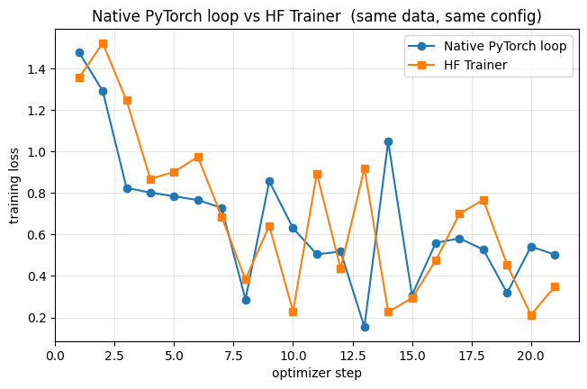
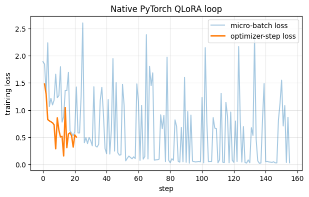
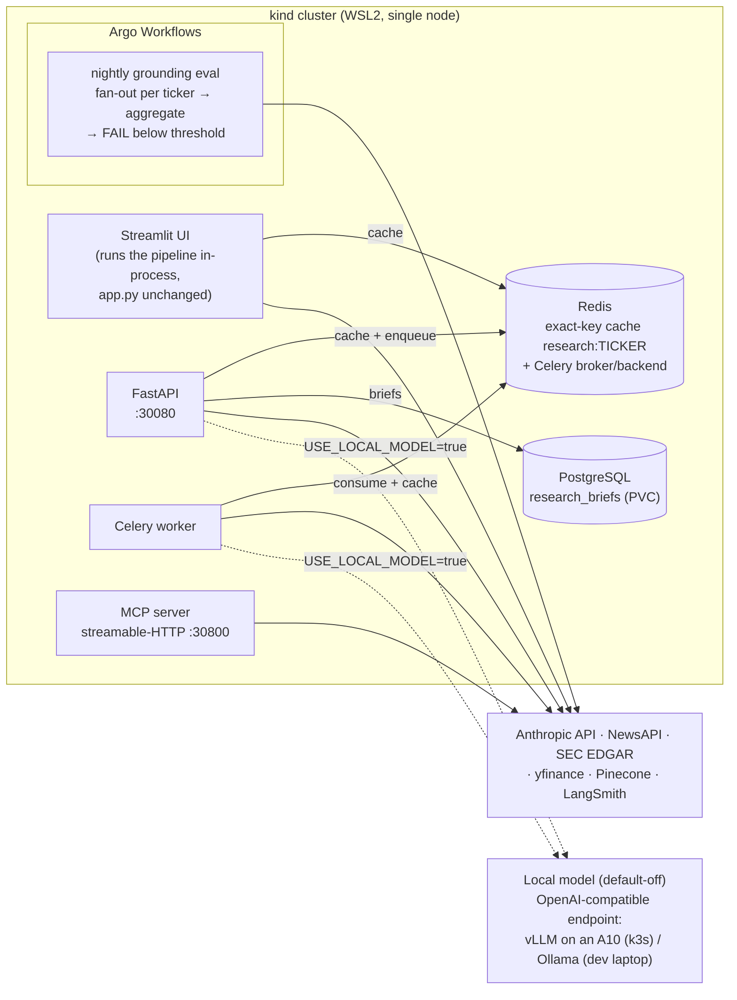

# 📈 Financial Research Agent

An AI agent that researches stocks and answers follow-up questions using live financial data, news, and SEC filings.

**Live Demo:** [financial-research-agent.streamlit.app](https://financial-research-agent.streamlit.app) | **Built with Claude Code**

**Documentation:** start at [docs/README.md](docs/README.md), which maps each question a reviewer might ask to the document that answers it.

---

## What it does

- **Generate Brief:** enter a ticker. The app fetches stock data (yfinance), news (NewsAPI) and SEC filing summaries (EDGAR), and grounds the SEC Filing Highlights and Risk Factors sections in filing text with Pinecone RAG. Claude Haiku writes the four middle sections in parallel, then Claude Sonnet streams the Executive Summary and Outlook. The brief is cached in Redis (exact key `research:{TICKER}`) and PostgreSQL.
- **Ask a follow-up:** a LangGraph ReAct agent answers free-form questions, picking the tools it needs (stock data, news, SEC filings, or RAG search).
- **Two execution paths:** the Streamlit UI runs the `agent/` pipeline in-process, and the FastAPI app runs the same code behind REST endpoints (the app Kubernetes deploys). There is no Streamlit-to-FastAPI hop.

## Highlights

- **Hosted vs self-served, measured without the judge first.** On one image (`f3043751`), hosted Claude and a self-served open-weight model (Qwen3.6-35B-A3B on llama.cpp, on an A10) ran the same 40-ticker eval. With no LLM judge involved: wrong stock figures per checked number **1/565 hosted vs 1/432 self-served** (adjudicated; not separated); currency-label errors **22 and 11 before the stock-data fix, 0 and 0 after**; and the self-served model states fewer figures, **3.05 vs 4.47 bound to stock data per brief** (paired +1.43 for hosted, CI +0.93 to +1.93). [Numbers of record](docs/numbers-of-record.md#current)
- **Judge-flagged grounding, secondary.** An LLM judge (judge v2) checks each brief's Executive Summary and Outlook against the retrieved sources; each run is judged three times. Unsupported, mean of three judgings: **hosted 2.55% vs A10 3.57%**, no difference detected (paired, CI −4.39 to +1.78 points). Read it beside the judge's limits: the same briefs re-judged moved by **up to 2×**, and on these runs its **precision is ~29% and its recall ~11%** (majority vote, blind human labels) — a flag is a weak signal and most unsupported claims go unflagged. The same model on CPU (`8vpq6`, previous image) was indistinguishable from the A10 there. [Method and calibration](docs/eval-methodology.md#numbers-of-record-on-the-stock-data-fix-image-three-judgings-per-run-and-the-judge-v2-calibration-on-those-runs-2026-10-0607)
- **What it costs.** Model cost per brief (dated, model cost only): hosted $0.0357 (n = 3) and the A10 $0.0303, a ceiling since the GPU averaged 36% utilization, both on `f3043751`; CPU $0.0107 at 13.7× hosted's per-ticker time on the previous image `1f51dad`, so batch work rather than interactive use. [Cost records](docs/numbers-of-record.md#dated-run-records)
- **Fine-tune vs hosted.** The fine-tuned model writes noticeably more unsupported claims than the hosted models, so it ships disabled. The QLoRA fine-tune, served in-cluster by vLLM, had 30/368 = 8.15% unsupported (CI 5.8–11.4%) against the hosted 12/392 = 3.06% (CI 1.8–5.3%) in the 40-ticker A/B (`lsnnc` vs `j4cnp`, judge v2), Fisher p = 0.0023. The reweighted estimates are 8.3% (CI 5.5–12.5%) vs 5.7% (CI 3.5–9.9%). It fails the 5% gate, so it ships disabled. [Dated run records](docs/numbers-of-record.md#dated-run-records), [model recommendation](docs/model-recommendation.md)
- **Deterministic numeric check.** A no-LLM check catches wrong stock figures, including in the sections the judge never reads; hosted models rarely get them wrong, and almost all of their errors come from two pipeline data bugs. It compares every stock-data figure a brief states (market cap, revenue, net income, profit margin, price, 52-week range) with the stock data the pipeline supplied. Of 359 live flags, 342 were true errors, 2 false positives and 15 other defects: precision 99.4% (Wilson 97.9–99.8%, other defects excluded), labeled by the author and not blind. Wrong stock figures per checked number (true errors only, all sections): hosted 19/1796 = 1.1% (cluster bootstrap 95% CI 0.4–1.8%) vs local-model 296/1980 = 14.9% (CI 12.7–17.3%). 18 of the 19 hosted errors trace to two upstream data defects, since fixed in image `f3043751` (2026-10-06). Why both layers exist: in the 2026-10-05 three-way the judge marked Toyota's "$52.0 billion" revenue SUPPORTED, from a source of 51.96 trillion in the filer's reporting currency (yen by its magnitude, inferred), labelled USD, and the numeric check flagged it; the check in turn cannot see a figure under the wrong label or a sub-2% truncation, which the judge caught. [Method and tables](docs/eval-methodology.md#numeric-check-adjudicated-flags-and-the-w4a16-replication-2026-10-01-dated)
- **4-bit (W4A16) on the A10.** 4-bit weights serve about 1.5x faster on the A10, with no demonstrated loss in grounding or numeric accuracy. Quantizing the fine-tune raised output throughput from 708.3 to 1075.7 tok/s at concurrency 8. The judge found no detectable difference on its audited sections: 23/344 = 6.69% (CI 4.5–9.8%) vs 25/385 = 6.49% (CI 4.4–9.4%), p = 1.00, judge v2, which is not proof of equivalence. A pre-registered section-level replication did not demonstrate a regression in wrong stock figures: +5.3 pts (CI −1.1 to +11.6). [Quantization benchmark](docs/eval-methodology.md#quantization-benchmark-2026-09-29-a-dated-measurement), [replication](docs/eval-methodology.md#numeric-check-adjudicated-flags-and-the-w4a16-replication-2026-10-01-dated)
- **CPU serving on the Xeon.** On this Xeon, switching serving engines mattered more than quantizing. The engine and the precision were measured separately, at concurrency 8. Engine: vLLM BF16 to llama.cpp F16 raised output from 22.9 to 52.3 tok/s. Precision, on llama.cpp: F16 / Q8_0 / Q4_K_M gave 52.3 / 51.7 / 64.5 tok/s. GGUF quantization quality was not evaluated. [CPU engine and precision](docs/eval-methodology.md#cpu-engine-and-precision-llamacpp-gguf)

## Next steps

- After the demo, the deferred image changes: shrink the eval pod's output parameter (the aggregate's template now needs Argo's ConfigMap offload), count "52-week" phrases as labels rather than figures, and the recorded pipeline limitations (watch-items the judge cannot ground, refused filing-highlights answers for five tickers, unreconciled conflicting figures between yfinance and the filing, truncated derived figures). Each changes the pipeline, so each means new baselines on every arm.
- Measure the A10 endpoint at higher parallelism before quoting a GPU cost floor: it averaged 36–38% utilization at parallelism 2.
- Apply the OKE Terraform when a compartment is available, and verify the vLLM `oke-gpu` overlay on the A10 pool.
- Switch the numeric check from warn to block once the data defects are fixed.
- Compare GGUF quantizations on grounding (one Q4_K_M build of Qwen3.6-35B-A3B and the fine-tune's W4A16 went through the grounding eval; no precision comparison of GGUF builds did).
- Benchmark other CPU targets (AMD EPYC, AMX-capable Xeon) and add OCI Generative AI as a hosted arm on the same harness.
- Test whether a multi-agent supervisor improves a small open-weight model on CPU.
- App plane, post-demo (no code change before the demo; the image stays `f3043751`). Four gaps found in the code, each fixed with a test that reproduces the failure first ([docs/reliability.md](docs/reliability.md)):
  1. **Worker crash loses the job.** Set `task_acks_late` (with `task_reject_on_worker_lost`) so a task in flight is redelivered, and make `research_task` idempotent so a redelivered task cannot write twice.
  2. **The async path never persists.** Write the brief to Postgres from the worker, as the synchronous route does, so `/history` covers both paths.
  3. **Lost or stuck jobs report the wrong status.** Add a deadline: a job still "processing" past it, or unknown to the result backend after a Redis restart, reports "error" or "lost" instead of "processing" or "queued".
  4. **No timeout on the Anthropic client.** Set an explicit request timeout (and keep the two retries deliberate rather than defaulted) so a hung call fails the request instead of holding it.

The fuller list, with the reasoning behind it: [Known limitations and next steps](docs/system-tour.md#known-limitations-and-next-steps).

---

## Deployed on OCI

- **Where:** a provided OKE cluster (v1.34.1, four VM.Standard.E5.Flex
  nodes at 16 vCPU, no GPUs) runs the app plane, the Argo eval harness and
  the CPU model endpoint; `vm-a10-inst-2`, a VM.GPU.A10.1 (1× A10 24 GB)
  on single-node k3s, serves the GPU model endpoint; `vm-a10-inst-1`, the
  first demo's k3s box with the fine-tuned model on vLLM, is frozen as a
  standby. Full statement and diagram:
  [docs/architecture.md, "Deployed topology"](docs/architecture.md#deployed-topology-october-2026).
- **What runs there:** the six services and Argo Workflows running the
  gated grounding-eval DAG on OKE, from one image pinned by git sha (the
  nightly CronWorkflow is suspended; runs are submitted from the operator
  host). Two llama.cpp endpoints serve the same Qwen3.6-35B-A3B Q4_K_M
  file: one on CPU inside the OKE cluster, one on node 2's A10, keyed and
  reachable only from the cluster's egress IP.
- **Access:** nothing is public. Every OKE Service is ClusterIP, reached
  by port-forward behind an ssh tunnel through a bastion; the A10 nodes
  admit ssh, plus node 2's model port from the cluster's egress IP only.
- **One manifest set:** a kustomize base with `kind`, `k3s`, `oke` and
  `oke-provided` overlays; `scripts/render_diff.py` proves overlay changes
  never alter the kind render ([docs/verification.md](docs/verification.md)).
- **OKE Terraform:** an OKE basic cluster with both node pools, including
  the A10 GPU pool, OCIR, an Object Storage bucket and a Block Volume
  storage class, written and passing `terraform validate`. It has **never
  been applied**: it waits on a compartment with OKE. The cluster above
  was provided, not created by it.
- **GPU inference:** what has been served on the A10, the fine-tune's
  BF16 vs W4A16 serving speed, and Qwen3.6 on CPU vs on the A10:
  [docs/gpu-inference.md](docs/gpu-inference.md).
- **Reliability:** how a request flows, what each component does when
  it fails (with what is and is not tested), and how the eval plane keeps
  runs trustworthy: [docs/reliability.md](docs/reliability.md).
- **How to deploy it:** [docs/deploy-runbook.md](docs/deploy-runbook.md),
  "OKE (provided cluster)" and the self-served SLM steps;
  [docs/operations.md](docs/operations.md) for an A10 node, teardown and
  troubleshooting. Configuration: [docs/configuration.md](docs/configuration.md);
  cost: [docs/cost.md](docs/cost.md).

## Key results

Every row links to [docs/numbers-of-record.md](docs/numbers-of-record.md),
which carries the full records and the rules for quoting them. Judge-v2
rates are judge-flagged rates. Calibration of record (2026-10-07, measured on `4hsn2` and `nstp9`, 180 blind labels): precision ~29%, population-weighted recall ~11% (majority vote of three judgings; CIs in the table). True-rate estimates, wide:
`4hsn2` 3.8% (CI 1.9–9.7%), `nstp9` 8.7% (CI 5.4–18.5%). The September
calibration (precision 60%, recall 32.5% on `j4cnp`) is a dated record.

| Result | Value (Wilson 95% CI) | Run ID / source | Judge | Status |
|---|---|---|---|---|
| Deterministic: wrong stock figures, currency labels, figures stated (40 tickers, no judge) | wrong figures per checked number 1/565 hosted vs 1/432 A10 (not separated); currency-label errors 0 and 0 (22 and 11 before the fix); figures bound to stock data 4.47 vs 3.05 per brief (+1.43, CI +0.93 to +1.93) | `4hsn2`, `nstp9` 2026-10-06; image `f3043751` | none | [number of record](docs/numbers-of-record.md#current) |
| Grounding, judge-flagged, three judgings (40 tickers) | mean (range): hosted 2.55% (1.47–3.76%) vs A10 3.57% (3.27–3.75%), no difference detected (paired CI −4.39 to +1.78 points); CPU 2.89% (2.13–3.63%) on the previous image, compared within it only | `4hsn2`, `nstp9` (`f3043751`); `8vpq6` (`1f51dad`) | v2 | [number of record](docs/numbers-of-record.md#current) |
| Former grounding numbers of record (one judging, image `1f51dad`) | hosted 7/411 = 1.70% (0.8–3.5%); CPU 9/248 = 3.63% (1.9–6.8%); A10 6/245 = 2.45% (1.1–5.2%) | `9jzmj`, `8vpq6`, `p9jr2`, 2026-10-04/05 | v2 | [dated record](docs/numbers-of-record.md#dated-run-records) |
| Former grounding number of record (40 tickers, 512-token RAG cap) | 12/392 = 3.06% unsupported (1.8–5.3%) | `j4cnp`, 2026-09-05/06 | v2 | [dated record](docs/numbers-of-record.md#dated-run-records) |
| Fine-tune vs hosted (40-ticker A/B) | 30/368 = 8.15% (5.8–11.4%) vs 12/392 = 3.06% (1.8–5.3%), Fisher p = 0.0023 — fails the 5% gate, ships disabled | `lsnnc` vs `j4cnp`, 2026-09-05/06 | v2 | [dated record](docs/numbers-of-record.md#dated-run-records) |
| Four-arm comparison (40 tickers) | hosted 4/383 = 1.04% (0.4–2.7%), same-image rerun 7/389 = 1.80% (0.9–3.7%); fine-tune 25/385 = 6.49% (4.4–9.4%); untuned Qwen2.5-1.5B 31/400 = 7.75% (5.5–10.8%); untuned Qwen2.5-7B 18/393 = 4.58% (2.9–7.1%) | `kcf7s`, `v924f`, `4nfsm`, `cnkp2`, 2026-09-23; `dvvxk` 2026-09-24 | v2 | [dated comparison set, not numbers of record](docs/numbers-of-record.md#dated-run-records) |
| Judge v2 calibration of record (blind labels, 2026-10-07) | precision on UNSUPPORTED 29.4% (8.3–52.9%), population-weighted recall 11.4% (3.1–27.9%), majority of three judgings; per judging 25.0–36.8% and 9.2–16.0% | `threejudge_sample.csv` on `4hsn2` + `nstp9` | v2 | [current](docs/numbers-of-record.md#current) |
| Judge v2 September calibration (2026-09-24; blind labels), a dated record since 2026-10-07 | kappa 0.580; UNSUPPORTED precision 9/15 = 60.0% (35.7–80.2%), population-weighted recall 32.5% on `j4cnp` (16.0–52.4%) | `holdout_sample.csv` (2026-09-06) + blind relabel `relabel_S.csv` (2026-09-24) | v2 | [dated record](docs/numbers-of-record.md#dated-run-records) |
| Cost per brief | $0.0366 (3-ticker mean; no interval computed) | `cost_record_post_fix.json`, 2026-09-06 | n/a (not a judged rate) | [cost of record](docs/numbers-of-record.md#current) |
| Model cost per brief, same pipeline | image `f3043751`: hosted $0.0357 (n = 3); A10 $0.0303, a ceiling (GPU at 36% utilization). Image `1f51dad`: CPU $0.0107 (pod request, 4 OCPU + 30 GiB); hosted $0.0370; A10 $0.0293. Model cost only | `f3043751` 2026-10-07; `1f51dad` 2026-10-05; OCI list prices read 2026-10-05 | n/a (not a judged rate) | [dated measurements](docs/numbers-of-record.md#dated-run-records) |
| Numeric check on the three-way, adjudicated | true errors per checked number: hosted 8/569, CPU 1/389, GPU 2/423, every one from the two upstream data defects; no paired difference excludes zero | 2026-10-05 | n/a (not a judged rate) | [dated record](docs/eval-methodology.md#gpu-slm-extended-run-p9jr2-2026-10-05-the-three-way-comparison-with-hosted-9jzmj-and-cpu-8vpq6) |
| Numeric check, adjudicated (live flags) | precision 342/344 = 99.4% (97.9–99.8%), other defects excluded; wrong stock figures per checked number, true errors only: hosted 19/1796 = 1.1% vs local-model 296/1980 = 14.9% (cluster bootstrap 95% CIs 0.4–1.8% and 12.7–17.3%) | `j4cnp`, `kcf7s`, `dvvxk`, `2nh8v`, `lsnnc`, `v924f`, `r5nzh`, `4nfsm`, `cnkp2`; adjudicated 2026-10-01 | n/a (not a judged rate) | [dated measurement, not a number of record](docs/numbers-of-record.md#dated-run-records) |
| W4A16 vs BF16 fine-tune | A10 output 1075.7 vs 708.3 tok/s at concurrency 8; judge 23/344 = 6.69% (4.5–9.8%) vs 25/385 = 6.49% (4.4–9.4%), Fisher p = 1.00; pre-registered replication on identical inputs (wrong stock figures, Financial Health + Risk Factors): +5.3 pts (paired bootstrap CI −1.1 to +11.6), the regression does not replicate | serving 2026-09-29; `r5nzh` (2026-09-29) vs `v924f` (2026-09-23); `replay-replication-2026-09-30` | v2 (judge result only) | [dated measurement (throughput); dated comparison, not a number of record (judge, replication)](docs/numbers-of-record.md#dated-run-records) |
| CPU engine and precision (Xeon, concurrency 8) | engine: vLLM BF16 22.9 vs llama.cpp F16 52.3 tok/s; precision on llama.cpp: F16 / Q8_0 / Q4_K_M 52.3 / 51.7 / 64.5 tok/s | `vm-a10-inst-2`, 2026-09-29 (`eval/runs/bench/cpu-gguf-2026-09-29/`) | n/a (not a judged rate) | [dated measurement, not a number of record](docs/numbers-of-record.md#dated-run-records) |

## Engineering decisions

Each decision, the measurement behind it, and what shipped. Rates are
judge-flagged; every judge version is named.

| Decision | Evidence | Result |
|---|---|---|
| Do not adopt the fine-tuned Qwen2.5-1.5B for the two sections it was trained on | 40-ticker A/B, judge v2, same image: `lsnnc` 30/368 = 8.15% vs hosted `j4cnp` 12/392 = 3.06% unsupported, Fisher p = 0.0023, with the excess in the two sections it writes (19.82% vs 0.50%, p = 4.6e-10). Four-arm set (2026-09-23): fine-tune `v924f` 6.49% vs hosted 1.04% and 1.80%. Numeric check (2026-10-01): 14.9% vs 1.1% wrong stock figures per checked number | `USE_LOCAL_MODEL` ships off; hosted models write every section. [QLoRA section](#qlora-fine-tuning-experiment) |
| Turn off the grounding critic (the multi-agent supervisor) | 10-ticker A/B, June 2026, judge v1, pre-retrieval-fix: 0/71 multi-agent vs 1/73 single-agent unsupported, the critic fired 0 revisions, latency 43.9 s vs 26.1 s (+68%), plus a Haiku planner call and a Sonnet critic call on every brief. On injected failures the critic caught 20/20 (2026-09-04): it works, and found no headroom | `MULTI_AGENT_ENABLED` ships default-off; the harness is kept. **Not re-tested under judge v2**, and a re-test was dropped before the demo (2026-10-07): the critic's value would be on qualitative claims, which the judge cannot measure on these runs (recall ~11%, calibration of record); numeric errors are already about 0.2% per checked number, leaving no room to show a gain; and an eval arm for it would change the frozen image. [Multi-agent section](#multi-agent-orchestration-experiment) |
| Turn off cross-encoder reranking | 4-arm A/B, 10 tickers, June 2026, judge v1, pre-retrieval-fix: no reliable grounding gain (0/66 baseline vs 0/84 and 0/69 reranked) at 4–5× the retrieval latency (4.1 s vs 20.4–20.7 s) | Reranking ships default-off. **Not re-tested under judge v2.** [Reranking section](#reranking-ab-experiment) |
| Serve the self-served Qwen3.6-35B-A3B with llama.cpp, not vLLM | Computed, not booted (2026-10-02): Qwen publishes BF16 and FP8 only; the community 4-bit builds leave at most about 1 GiB of an A10's 24 GB after the weights, no usable context; node 2's driver supports CUDA 12.8, and vLLM ≥ 0.19.0, the first with this architecture's quantized-layer fix, publishes no CUDA 12.8 image | llama.cpp b11347 serves one Q4_K_M GGUF on CPU (OKE) and on the A10, all layers on the GPU (20,488 of 23,028 MiB). [Dated finding](docs/eval-methodology.md#dated-finding-computed-not-booted-no-4-bit-qwen36-35b-a3b-fits-one-a10-under-vllm-2026-10-02) |
| Keep hosted models as the production path | Image `f3043751`, 40 tickers: wrong stock figures 1/565 hosted vs 1/432 self-served, not separated; the self-served model states fewer figures (3.05 vs 4.47 bound per brief, CI on the difference +0.93 to +1.93); judge-flagged grounding, three judgings, 2.55% vs 3.57%, no difference detected. On CPU it takes 13.7× hosted's time per brief (image `1f51dad`) | Hosted is the default; `SLM_FULL` ships off in the app. The self-served model is a measured option, not adopted. [Numbers of record](docs/numbers-of-record.md#current) |
| Match CPU or GPU serving to the workload | The same model on CPU and on the A10, image `1f51dad`: no detected difference in what it writes (figures per brief +0.15, CI −0.35 to +0.68). Model cost per brief: CPU $0.0107 at 355 s; A10 at most $0.0293 at 31 s, a ceiling (the GPU averaged 38% utilization); hosted $0.0370 (n = 3) at 26 s | CPU suits batch work (overnight briefs, the eval); the A10 suits interactive latency. Neither is in production. [Cost](docs/eval-methodology.md#gpu-slm-extended-run-p9jr2-2026-10-05-the-three-way-comparison-with-hosted-9jzmj-and-cpu-8vpq6) |
| Keep two eval layers: the LLM judge and a deterministic numeric check | The judge marked Toyota's "$52.0 billion" revenue SUPPORTED, from a source of 51.96 trillion in the filer's reporting currency (yen by its magnitude, inferred) labelled USD; the numeric check flagged it. The check cannot see a truncation under its 2% tolerance (CPU's CHGG, 0.18% off) or a correct figure under the wrong label (A10's SFIX and CRBU), both of which the judge flagged, and it checks stock-data figures only. It catches the currency defect only when a brief's figure departs from the mislabelled field: a faithful copy (the CPU arm's "$51.96 trillion") passes both layers ([the limits of each layer](docs/debugging-story.md#the-limits-of-each-layer)) | Both layers are kept: the judge in the eval DAG, the numeric check inside the brief pipeline (`NUMERIC_CHECK=warn` by default: it appends a note; `block` would replace a flagged brief) and offline over every run's findings. It stays at warn; the two upstream data defects were fixed in image `f3043751` (2026-10-06). [Debugging story](docs/debugging-story.md) |

---

## Why This Exists

I built this to answer a question I couldn't find a good answer to: *can an LLM agent produce investment briefs that are actually grounded in real sources -- and how would you even know?*

The answer required building both the agent and the measurement layer to audit it.

---

## What I Measured (and What I Found)

### Grounding Eval (LLM-as-judge)

I built an evaluation framework that audits the quantitative and forward-looking claims in each brief's Executive Summary and Outlook against the retrieved source context (the four pre-written sections are judge input, not audited directly). A Sonnet judge (temperature 0) labels each claim `SUPPORTED`, `UNSUPPORTED`, or `INFERENCE`.

**Current (image `f3043751`, 40 tickers, judge v2, three judgings per run).** Measured without the judge first: wrong stock figures 1/565 hosted vs 1/432 for the self-served model on the A10, currency-label errors 0 and 0 (22 and 11 before the stock-data fix), figures bound to stock data 4.47 vs 3.05 per brief. Judge-flagged, mean (range) of three judgings: hosted `4hsn2` 2.55% (1.47–3.76%), A10 `nstp9` 3.57% (3.27–3.75%); no difference detected. The CPU arm `8vpq6` (2.89%) is from the previous image and compared only within it. The judge's calibration on these runs: precision ~29%, recall ~11% (majority vote), with true-rate estimates of 3.8% (CI 1.9–9.7%) and 8.7% (CI 5.4–18.5%), wide. Details in [docs/numbers-of-record.md](docs/numbers-of-record.md).

*Former numbers of record:* the one-judging three-way on image `1f51dad` (2026-10-05 to 2026-10-07: `9jzmj` 1.70%, `8vpq6` 3.63%, `p9jr2` 2.45%), and before it (2026-09-06 to 2026-10-05) hosted `j4cnp` 12/392 = 3.06% (CI 1.8–5.3%), judge v2, reweighted true-rate estimate 5.7% (CI 3.5–9.9%). It ran under a 512-token RAG answer cap, so it is a different pipeline from the later runs; it is not a before/after with them. It stays the hosted arm of the fine-tune A/B below.

**The fine-tune A/B: 8.15% vs 3.06%, Fisher p = 0.0023 (judge v2).** On the same image and index, with the QLoRA fine-tune writing two of the four sections, the local-model arm `lsnnc` measured 30/368 = 8.15% unsupported (CI 5.8–11.4%) against `j4cnp`'s 3.06%. It fails the 5% gate, the excess sits in the two sections the fine-tune writes, and it ships disabled ([details below](#qlora-fine-tuning-experiment)).

*Judge-version note:* every unsupported rate in this README names its judge prompt version. **v1** rates are lower bounds (2026-09-04 human validation: v1 recall on UNSUPPORTED 1/9). **v2** rates are judge-flagged rates. The calibration of record is the 2026-10-07 one above, measured on the current runs; the September calibration (2026-09-24: kappa 0.580, precision 60%, CI 35.7–80.2%; population-weighted recall 32.5% on the baseline run, CI 16.0–52.4%) is a dated record and applies to the runs of its time, with their reweighted true-rate estimates. A/B directions are unaffected when both arms share the judge ([docs/eval-methodology.md](docs/eval-methodology.md)).

*Dated history (judge v1, pre-retrieval-fix; not current):* before the synthesis prompt's grounding rules, the first measurement found 49% of claims unsupported (pre-harness, no recorded denominator). After them, the 2026-08-24 10-ticker re-measure found 0/84. Both predate judge v2 and the 2026-09-04 retrieval fix, and v1 rates are lower bounds.

### Self-served open-weight model vs hosted (October 2026)

**Question:** can a self-served open-weight model write the whole brief —
sections, synthesis and RAG answers — as well as hosted Claude, and what
does it cost? **Answer, on this sample:** it gets stock figures wrong
about as rarely as hosted (1/432 vs 1/565, no judge involved), it states
fewer figures, no judge-flagged grounding difference was detected, and on
CPU it is the cheapest per brief but 13.7× slower per ticker.

**Setup.** Qwen3.6-35B-A3B (a mixture-of-experts model, 35B parameters,
3B active), one Q4_K_M GGUF file served by llama.cpp b11347 from two
endpoints: CPU inside the OKE cluster (8 CPU / 30 GiB) and node 2's A10
(all layers on the GPU). With `SLM_FULL` every agent call goes to the
endpoint; the judge stays hosted. Why llama.cpp rather than vLLM: Qwen
publishes this model in BF16 and FP8 only, and the community 4-bit builds
leave at most about 1 GiB of an A10's 24 GB after the weights — no usable
context for the KV cache — while node 2's driver (CUDA 12.8) has no
matching vLLM image for the minimum version that supports the
architecture. That was computed from the published artifacts, not booted
([dated finding](docs/eval-methodology.md#dated-finding-computed-not-booted-no-4-bit-qwen36-35b-a3b-fits-one-a10-under-vllm-2026-10-02)).

**Current: image `f3043751`** (stock-data fix plus currency-labelling
prompt rule), hosted `4hsn2` vs the A10 `nstp9`, 40 tickers, judge v2
judged three times. The A10 run passed its traffic proof; both CPU runs on
this image failed theirs and are not citable, so the CPU arm stays on the
previous image (table below). Only same-image arms are compared.

| | Hosted `4hsn2` | A10 `nstp9` |
|---|---|---|
| Wrong stock figures per checked number (numeric check, adjudicated) | 1/565 | 1/432 |
| Currency-label errors (22 and 11 before the fix) | 0 | 0 |
| Figures bound to stock data per brief (no judge) | 4.47 | 3.05 |
| Unsupported, all claims, mean (range) of three judgings | 2.55% (1.47–3.76%) | 3.57% (3.27–3.75%) |
| Unsupported, numeric claims, mean (range) | 0.86% (0.73–1.11%) | 2.42% (2.38–2.47%) |
| Pipeline time per ticker | 26.7 s | 34.6 s |
| Model cost per brief (dated, model cost only) | $0.0357 (n = 3) | $0.0303 (a ceiling) |

The two wrong figures are one kind: the current price given as the 52-week
low (UPST, EVGO). Figures stated: hosted +1.43 per brief (CI +0.93 to
+1.93). Judge-flagged grounding: no difference detected (paired CI −4.39 to
+1.78 points), read beside the judge's noise (up to 2× between judgings)
and its calibration on these runs (precision ~29%, recall ~11%).

**Previous image `1f51dad`: the three-way with CPU** (one judging each; the
former numbers of record). Both SLM runs passed a traffic proof: the tokens
the harness logged equal the endpoint's own counters exactly, so every call
reached the self-served model and nothing else used it during the run.
No run needed a retry. Tests are exact two-sided Fisher (rates) and paired
per-ticker sign tests (density), not adjusted across the three pairs.

| | Hosted `9jzmj` | CPU `8vpq6` | A10 `p9jr2` |
|---|---|---|---|
| Unsupported, all claims (judge-flagged) | 7/411 = 1.70% | 9/248 = 3.63% | 6/245 = 2.45% |
| Unsupported, numeric claims | 2/277 = 0.72% | 3/161 = 1.86% | 3/155 = 1.94% |
| Model errors among numeric claims (adjudicated by type) | 2/277 | 1/161 | 2/155 |
| Numeric claims per ticker | 6.9 | 4.0 | 3.9 |
| Pipeline time per ticker | 25.9 s | 355.1 s | 31.1 s |
| Model cost per brief (dated, model cost only) | $0.0370 (n = 3) | $0.0107 | $0.0293 (a ceiling) |

- **Grounding:** no pair separates on any denominator (p ≥ 0.126 all
  claims, ≥ 0.35 numeric claims). That is "not detected at this sample
  size", not "equivalent": the SLM arms' upper bounds reach 5–7%.
- **Density:** both SLM arms state about 3 fewer figures per ticker than
  hosted (paired p ≤ 1e-8), so their rates are over fewer checkable
  figures. CPU and GPU do not differ (+0.15 per ticker, CI −0.35 to
  +0.68): the same model writes the same kind of brief on either hardware.
- **Error types** (every judge-flagged numeric claim adjudicated): the
  CPU arm misquoted one value (CHGG, truncated), the A10 arm put two
  correct figures under the wrong label (SFIX, CRBU), and hosted asserted
  two things the context did not hold (AFRM, NVO). Source conflicts
  between yfinance and the filing recur (BEAM, OMER).
- **Numeric check** (no LLM): every true error in all three arms came
  from the two upstream data defects, fixed in `f3043751`; it also caught
  the Toyota figure the judge accepted.
- **Speed and cost:** the A10 is 10–15× faster than CPU at every call site
  and 1.2× hosted's per-ticker time (1.3× on `f3043751`). The CPU endpoint was saturated; the
  A10 averaged 38% utilization at parallelism 2, so its cost per brief is a
  ceiling. Costs exclude the harness, storage and the judge.
- **Tool use** (the ReAct `/ask` agent, ten questions per route, no
  judge): all three routes called the right tool and completed every
  question. Ten questions cannot rank them.

Full tables, per-section results, the known limitations and every command:
[the current runs](docs/eval-methodology.md#numbers-of-record-on-the-stock-data-fix-image-three-judgings-per-run-and-the-judge-v2-calibration-on-those-runs-2026-10-0607) and
[the `1f51dad` three-way](docs/eval-methodology.md#gpu-slm-extended-run-p9jr2-2026-10-05-the-three-way-comparison-with-hosted-9jzmj-and-cpu-8vpq6);
the deployment: [architecture.md](docs/architecture.md#deployed-topology-october-2026).

### Reranking A/B Experiment

I added optional cross-encoder reranking to the RAG pipeline and ran a controlled 4-arm eval across 10 tickers to measure whether it improved grounding. A dated record: Jun 2026, judge v1, pre-retrieval-fix, local `grounding_check.py` runs (pre-Argo, so no workflow run IDs); intervals from `eval/stats.py`:

| Arm | Claims | Grounding | Unsupported (judge v1, Wilson 95% CI) | Retrieval Latency |
|---|---:|---:|---:|---:|
| Baseline (top-3, no rerank) | 66 | 92.4% | 0/66 = 0.0% (0.0–5.5%) | 4.1s |
| Plain top-5 (no rerank) | 74 | 86.5% | 1/74 = 1.4% (0.2–7.3%) | 4.5s |
| Rerank 20→3 | 84 | 78.6% | 0/84 = 0.0% (0.0–4.4%) | 20.7s |
| Rerank 20→5 | 69 | 85.5% | 0/69 = 0.0% (0.0–5.3%) | 20.4s |

**Conclusion:** reranking adds 4--5x retrieval latency with no reliable grounding benefit. It ships default-off. The measurement framework is the deliverable -- it's what demonstrates the feature isn't needed, rather than assuming it would help.

### QLoRA Fine-Tuning Experiment

Can a small local model replace Claude Haiku on section generation at lower cost?

I fine-tuned **Qwen2.5-1.5B-Instruct** with QLoRA on 104 deterministic, Claude-free training pairs built from real SEC filings and financial data. When enabled, the fine-tuned model is routed 2 of 4 brief sections (Financial Health and Risk Factors); the other two stay on Haiku because deterministic targets couldn't be built for them -- an honest finding about the data, not a gap to paper over. **The measured verdict (2026-09-05/06, 40-ticker in-cluster A/B, judge v2, same image and index): the fine-tune fails the 5% grounding gate -- 8.15% unsupported (`lsnnc`, 30/368, Wilson 95% CI 5.8–11.4%) vs a 3.06% hosted baseline (`j4cnp`, 12/392, CI 1.8–5.3%), Fisher p = 0.0023 -- and the failure concentrates in exactly the two sections it owns (19.82%, 22/111, CI 13.5–28.2%, vs 0.50%, 1/202, CI 0.1–2.8%, on attributed claims; same two runs), so it ships default-off.** These are judge-flagged v2 rates; reweighted true-rate estimates are 8.3% (CI 5.5–12.5%) vs 5.7% (CI 3.5–9.9%), and the direction stands because both arms share the judge. The rest of this section is the experiment record.

**No measurable full-brief cost reduction.** Measured with the committed cost
harness (`scripts/cost_report.py`; details in [benchmarks.md](benchmarks.md)),
Sonnet synthesis dominates the bill: hosted $0.0316/brief vs hybrid
$0.0321/brief (both on the pre-retrieval-fix pipeline; the current cost of
record is **$0.0366/brief**, 2026-09-06 post-retrieval-fix) -- the saving on
the two local sections is within run-to-run variance. Shipped default-off.

**Aug 2026 re-measure ([benchmarks.md](benchmarks.md)):** the grounding
regression reproduced in direction -- grounding (supported share) 86.2% hosted
(56/65, Wilson 95% CI 75.7–92.5%) vs 77.8% hybrid (56/72, CI 66.9–85.8%);
judge v1, 9 tickers balanced, pre-retrieval-fix, local `grounding_check.py`
run with no workflow run ID. The local model runs behind a pluggable OpenAI-compatible backend
(`LOCAL_MODEL_BACKEND=openai`); on this AVX2-only dev CPU the prebuilt vLLM
image SIGILLs (root-caused to its AVX-512 requirement), so locally the code
path is exercised via Ollama's `/v1` endpoint.

**Sep 2026 GPU serving + in-cluster A/B:** vLLM v0.10.2 served the merged
fine-tune pinned to one A10 on an OCI VM -- plain Docker (2026-09-02), then
in-cluster on single-node k3s (2026-09-03) -- and the gated eval DAG ran a
40-ticker A/B against it (2026-09-05/06, judge v2, same image and index both
arms): **8.15% unsupported (`lsnnc`, 30/368, CI 5.8–11.4%) vs the hosted
baseline 3.06% (`j4cnp`, 12/392, CI 1.8–5.3%), Fisher p = 0.0023** -- the
local-model arm fails the 5% gate, the hosted baseline passes, and
per-section attribution places the excess entirely in the two
fine-tune-owned sections (**19.82%, 22/111, CI 13.5–28.2% vs 0.50%, 1/202,
CI 0.1–2.8%**, p = 4.6e-10). An earlier 10-ticker pass agreed in direction
but could not separate the arms (dated records in
[docs/eval-methodology.md](docs/eval-methodology.md)). A measured negative
result, and the reason `USE_LOCAL_MODEL` ships off.

**Four-arm comparison (2026-09-23, a dated comparison set, not numbers of
record; 40 tickers, judge v2, identical pinned sampling).** To separate
training from model size, the same harness scored four arms that differ
only in who writes Financial Health and Risk Factors: each local model
writes those two sections, while Haiku writes the other two and Sonnet the
synthesis in every arm. Unsupported rates: the hosted baseline (`kcf7s`,
4/383 = 1.04%, CI 0.4–2.7%; its same-image rerun `dvvxk` 7/389 = 1.80%, CI 0.9–3.7%), the fine-tune (`v924f`, 25/385 = 6.49%, CI 4.4–9.4%), its
untuned base Qwen2.5-1.5B-Instruct (`4nfsm`, 31/400 = 7.75%, CI 5.5–10.8%),
and untuned Qwen2.5-7B-Instruct (`cnkp2`, 18/393 = 4.58%, CI 2.9–7.1%). The
fine-tune matched its own base (p = 0.58); within Qwen2.5, 1.5B → 7B
improved with borderline significance (p = 0.076) at 3.7x lower serving
throughput on the same A10; and every open-weight arm trailed hosted (7B vs
hosted p = 0.0039). Judge-flagged v2 rates; comparisons hold in
direction because all arms share the judge. Details: [docs/eval-methodology.md](docs/eval-methodology.md).

I also re-implemented the same fine-tune with a hand-written PyTorch training loop (`fine_tune_pytorch_loop.ipynb`) -- custom `Dataset`, manual gradient accumulation and `optimizer.step()`, hand-written cosine LR, no Hugging Face `Trainer`. Benchmarked against the `Trainer` on identical data and config (`adamw_torch`, cosine schedule, grad-accum 8), the two loss curves track each other closely over 21 optimizer steps -- both start around 1.4--1.5 and trend down together, finishing at **0.50 (native)** and **0.35 (Trainer)**. The curves cross repeatedly, so that final-step gap sits within the run-to-run noise at this scale (~7 optimizer steps/epoch, plus shuffle order and 4-bit-kernel non-determinism) rather than a systematic difference -- confirming the hand-written loop reproduces the Trainer's training dynamics at the gradient-accumulation and optimizer-step level.





### Multi-Agent Orchestration Experiment

Does breaking the single agent into a supervisor-orchestrated team improve
grounding, or just add cost?

I refactored the brief pipeline into a supervisor graph: a **planner** decomposes
the ticker into SEC retrieval sub-questions and coverage points, a **research**
agent executes the plan against the existing RAG and model-routing code, an inline
**grounding-critic** scores the drafted brief with the same LLM-as-judge used by
the offline eval, and a **supervisor** sends the brief back for revision (bounded
at 2 passes) until it clears a grounding threshold. It is flag-gated behind
`MULTI_AGENT_ENABLED` (default off), with the original single-agent pipeline kept
as the A/B control. The inline critic and the offline judge share one definition,
so there is a single source of truth for grounding.

I ran both paths over the standard 10-ticker set, scored by the same
temperature-0 Sonnet judge, with retrieval held at baseline (reranking off, top-3)
on both sides so the only differences were the planner-driven queries and the
critic loop. Critic threshold: 5% unsupported. A dated record: Jun 2026,
judge v1, pre-retrieval-fix, local runs (pre-Argo, no workflow run IDs);
intervals from `eval/stats.py`.

| Path | Claims | Unsupported (judge v1, Wilson 95% CI) | Latency/brief | Revisions/brief |
|---|---:|---:|---:|---:|
| Single-agent (control) | 73 | 1/73 = 1.4% (0.2–7.4%) | 26.1s | 0.00 |
| Multi-agent | 71 | 0/71 = 0.0% (0.0–5.1%) | 43.9s | 0.00 |
| Delta | | -1.4 pts | +68% | n/a |

The multi-agent path also costs more per brief (an extra Haiku planner call
and a Sonnet critic call on every brief). The cost ratio this experiment
recorded came from an uncommitted harness, so it is kept only as a historical
note in [docs/PHASE0_AUDIT.md](docs/PHASE0_AUDIT.md) and not quoted here; the
current re-runnable cost of record for the single-agent pipeline is
**$0.0366/brief** (2026-09-06, post-retrieval-fix; `scripts/cost_report.py`).

Two findings, stated plainly:

1. **The critic fired 0 revisions across all 10 real drafts.** The base pipeline
   already drives unsupported claims to the floor (1/73 on the control arm
   above; a later re-measure on 2026-08-24 found 0/84, Wilson 95% CI
   0.0–4.4%, judge v1, pre-retrieval-fix, local run with no workflow run ID) on the
   Executive Summary and Outlook sections this eval scores, so the critic looked at
   every first draft, found nothing to fix, and passed it. There was no headroom
   for the revision loop to recover.

2. **The one single-agent unsupported claim did not reproduce.** Across 73
   single-agent claims exactly one was flagged (on WMT). Re-running WMT produced a
   different draft with zero unsupported claims, confirming the lone flag was
   temperature-0.2 generation variance, not a systematic weakness in the base
   synthesis prompt.

The orchestration adds cost and latency (the planner adds a Haiku call, and the
inline critic adds a Sonnet judge to every brief) for a grounding benefit that,
on this workload, was null.

**Conclusion: it ships default-off.** On this workload the multi-agent path showed
no grounding benefit because the single-agent baseline was already at the
grounding floor, leaving nothing for the critic to recover. That is a statement
about this corpus, not a general claim about multi-agent orchestration. The
revision loop itself is verified working (an injected bad draft with a fabricated
price target is caught by the live judge, sent back, and cleaned on the second
pass); it is dormant in practice, not broken. The harness is retained to
re-measure if a harder corpus, thinner retrieval, a weaker base model, or longer
briefs ever create real grounding headroom. If that happens, a three-way
comparison (baseline / planner-only / planner+critic) is the documented next step
to attribute any gain to the planner versus the critic. As with the reranking
experiment, the deliverable is the measurement that shows when the feature is and
is not worth its cost.

---

## Tech Stack

| Layer | Technology |
|---|---|
| LLM -- section generation | Claude Haiku 4.5 (4 sections in parallel) |
| LLM -- synthesis + ReAct agent | Claude Sonnet 4.6 |
| Agent framework | LangGraph -- `create_react_agent` (follow-ups) + a supervisor `StateGraph` (optional multi-agent brief pipeline) |
| Financial data | yfinance |
| News | NewsAPI |
| SEC filings | SEC EDGAR REST API |
| SEC RAG | LlamaIndex + Pinecone + HuggingFace `bge-small-en-v1.5` |
| Reranking (optional) | Cross-encoder `BAAI/bge-reranker-base` |
| Observability | LangSmith (tool calls, tokens, latency, cost) |
| Brief cache | Redis (exact key per ticker, `research:{TICKER}`) |
| Persistence | PostgreSQL via SQLAlchemy |
| Async tasks | Celery + Redis |
| REST API | FastAPI |
| Frontend | Streamlit |
| Orchestration | Kubernetes — kind (local, single node in WSL2) and single-node k3s on two OCI A10 VMs; full topology incl. worker + MCP |
| Batch / eval orchestration | Argo Workflows v3.7 (fan-out eval DAG, nightly CronWorkflow, quality gate) |
| Local model serving (default-off) | OpenAI-compatible backend: vLLM v0.10.2 on one OCI A10 (k3s) / Ollama `/v1` on the dev laptop (no AVX-512 for vLLM) — see [benchmarks.md](benchmarks.md) |
| Cloud (backend) | AWS ECS Fargate, RDS PostgreSQL, Secrets Manager, ECR |
| Infrastructure as Code | Terraform |
| CI/CD | GitHub Actions → ECR → ECS (OIDC, no static keys) |
| Development | Claude Code |

---

## Architecture

### Deployment topology (Kubernetes)

Where it runs on OCI today (the provided OKE cluster, node 2's A10 endpoint,
the standby VM) is in [docs/architecture.md, "Deployed topology"](docs/architecture.md#deployed-topology-october-2026).
The full designed topology runs on a single-node kind cluster locally and on
single-node k3s on the OCI A10 VMs (see [k8s/README.md](k8s/README.md),
[docs/deploy-runbook.md](docs/deploy-runbook.md), and the audit in
[docs/PHASE0_AUDIT.md](docs/PHASE0_AUDIT.md)). The diagram shows the kind
layout; the k3s overlay adds vLLM on the node's A10:


```mermaid
flowchart LR
    subgraph kind["kind cluster (WSL2, single node)"]
        ST["Streamlit UI<br/>(runs the pipeline in-process,<br/>app.py unchanged)"]
        API["FastAPI<br/>:30080"]
        WK["Celery worker"]
        RD[("Redis<br/>exact-key cache research:TICKER<br/>+ Celery broker/backend")]
        PG[("PostgreSQL<br/>research_briefs (PVC)")]
        MCP["MCP server<br/>streamable-HTTP :30800"]
        subgraph argo["Argo Workflows"]
            WF["nightly grounding eval<br/>fan-out per ticker → aggregate<br/>→ FAIL below threshold"]
        end
    end
    EXT["Anthropic API · NewsAPI · SEC EDGAR<br/>· yfinance · Pinecone · LangSmith"]
    LOCAL["Local model (default-off)<br/>OpenAI-compatible endpoint:<br/>vLLM on an A10 (k3s) / Ollama (dev laptop)"]

    API -->|"cache + enqueue"| RD
    API -->|"briefs"| PG
    WK -->|"consume + cache"| RD
    ST -->|"cache"| RD
    API --> EXT
    WK --> EXT
    ST --> EXT
    MCP --> EXT
    WF --> EXT
    API -.->|"USE_LOCAL_MODEL=true"| LOCAL
    WK -.->|"USE_LOCAL_MODEL=true"| LOCAL
```

- **Celery vs. Argo:** request-time async stays on Celery; batch/eval runs on
  Argo (reasoning in the [Celery vs. Argo section](#kubernetes-and-the-celery-vs-argo-split)).
- **Eval pods** force `BYPASS_CACHE=true` and never touch the live cache.
- **Feature flags** are restated at their audited defaults in the ConfigMap;
  reranking, multi-agent, and the local model all ship off, each for a
  measured reason.

### Brief pipeline

```
"Generate Brief"
       │
       ▼
Redis cache (research:TICKER) ──hit──► cached brief
       │ miss
       ▼
get_stock_data  (yfinance)
       │
       ▼
┌──────────────────┐  ┌─────────────────┐
│ get_company_news │  │ get_sec_filings  │  parallel
└──────────────────┘  └─────────────────┘
       │                       │
       └───────────┬───────────┘
                   │
       ┌───────────▼───────────┐
       │   Pinecone RAG (x2)   │  concurrent
       └───────────┬───────────┘
                   │
   ┌───────────────┼───────────────────┐
   ▼               ▼           ▼       ▼
Haiku           Haiku       Haiku   Haiku    4 parallel calls
Financial       Recent      SEC     Risk
Health          Dev.        High.   Factors
   └───────────────┴───────────┴───────┘
                   │
       ┌───────────▼───────────┐
       │  Sonnet: Exec Summary │  streams to browser
       │  + Outlook            │
       └───────────────────────┘
```

### Follow-up questions

```
"Ask" (free-form question)
       │
       ▼
LangGraph ReAct agent (claude-sonnet-4-6)
  ├─ get_stock_data
  ├─ get_company_news
  ├─ get_sec_filings
  └─ query_sec_filing (Pinecone RAG)
       │
       ▼
     answer
```

### Multi-agent brief pipeline (optional, `MULTI_AGENT_ENABLED=true`)

The single-agent brief pipeline can be swapped for a supervisor-orchestrated
graph. It's off by default -- the single-agent path stays the production default
and the A/B control -- and produces the **same brief schema and API response**, so
nothing downstream changes. Toggle the flag to compare the two paths.

```
"Generate Brief"  (MULTI_AGENT_ENABLED=true)
       │
       ▼
   ┌─────────┐  decomposes the ticker into a research plan: the SEC RAG
   │ Planner │  sub-questions that ground the filing-based sections + coverage
   └────┬────┘
        ▼
   ┌──────────┐ ◄──── revise (critic feedback prepended to the synthesis prompt)
   │ Research │  reuses the EXISTING retrieval + model-routing + synthesis code;
   └────┬─────┘  revision passes re-synthesise Exec Summary + Outlook only
        ▼
   ┌──────────────────┐  the existing LLM-as-judge, promoted to an inline node --
   │ Grounding-critic │  scores the draft for source-grounding (one judge, shared
   └────┬─────────────┘  with the offline eval; `agent/grounding.py`)
        ▼
   ┌────────────┐  unsupported% ≤ CRITIC_MAX_UNSUPPORTED_PCT → done; else send
   │ Supervisor │  back to Research, bounded at MAX_REVISIONS passes
   └────┬───────┘
        ▼
   final brief
```

- **One judge, two callers.** The inline critic and the offline grounding eval
  both call `agent/grounding.py:grade_brief()` -- there's a single definition of
  the judge prompt and scoring, not two copies that can drift.
- **Schema-safe revisions.** Revision passes reuse the already-grounded middle
  sections and only re-write the Executive Summary + Outlook through the same
  `_synthesis_prompt`, so the brief format can't break.
- **Bounded loop.** `MAX_REVISIONS` (default 2) caps the critic→research retries;
  the supervisor accepts the best effort if the budget is exhausted.
- **Tracing.** Each node (planner / research / critic / supervisor) is its own
  LangSmith span.

---

## AWS Deployment (secondary)

The primary deployment is on OCI ([above](#deployed-on-oci)). AWS ECS is a secondary, single-container deployment of the API only.

The FastAPI backend is containerized and runs on **AWS ECS Fargate**, with a real
**RDS PostgreSQL** database, secrets in **AWS Secrets Manager**, and a
**GitHub Actions** deploy workflow that runs **on manual dispatch only**
(since 2026-09-28; a merge to `main` no longer deploys). Run it from `main`
(Actions → Deploy → Run workflow) after CI has passed on that commit; it builds
and deploys the dispatched commit. The whole
footprint is defined in **Terraform** (`infra/`). The Streamlit frontend stays on
Streamlit Cloud; Redis/Celery are stubbed in this environment (the cache no-ops
and the async endpoint is disabled).

```
CI green on main, then manual "Run workflow" (Deploy)
     │
     ▼
GitHub Actions ──OIDC (no long-lived AWS keys)──► assume scoped IAM role
  1. checkout the dispatched commit (CI is the separate pytest gate)
  2. docker build → push image (latest + commit SHA) → Amazon ECR
  3. register new task-def revision → update ECS service (wait for stable)
     │
     ▼
ECS Fargate task  (public subnet, public IP, security group locked to my IP)
  FastAPI container (uvicorn, single worker; bge-small model baked into image)
     │                                   │
     ▼                                   ▼
RDS PostgreSQL (t3.micro)        Secrets Manager
  research_briefs table            ANTHROPIC / NEWS / PINECONE / LANGSMITH keys,
  (private, SG-locked to           DATABASE_URL, REDIS_URL — injected as task
   the task's SG)                  env vars by the execution role
```

**Current state.** The service normally runs at 0 tasks. The image last
verified running was `c602e99` (task definition revision 8), on 2026-09-24,
by scaling to 1: `/health` returned 200 and an AAPL brief returned 200 with
all six sections, then the service was parked at 0 again. The automatic
deploys that followed each merge that day (the last at `7e17b4b`) ran at 0
tasks and were not verified the same way. Two caveats: the task
definition has no container health check (Fargate ignores the image's
Dockerfile `HEALTHCHECK`), so ECS reports health as UNKNOWN; and at 0 tasks a
deploy's "wait for stable" passes without starting a container, so a deploy
alone doesn't prove the new image runs.

**Design choices**

- **Terraform, end to end** — ECR, RDS, Secrets Manager, IAM roles, security
  groups, the ECS cluster/task-def/service, and the GitHub OIDC provider are all
  in `infra/`. Local state; `terraform.tfvars` (with my IP) is gitignored.
- **No static cloud credentials** — GitHub Actions authenticates via **OIDC**,
  assuming a repo-scoped IAM role with just enough permission to push to ECR and
  deploy the service. Nothing long-lived is stored in the repo.
- **Secrets never in the image or git** — they live in Secrets Manager and are
  injected into the task as environment variables at runtime via the execution
  role.
- **Cost-aware** — RDS `t3.micro` on the free tier; Fargate runs in a **public
  subnet with a public IP (no NAT gateway)** to avoid NAT cost; the task's
  security group is locked to a single IP, so the unauthenticated API isn't open
  to the world.
- **Image** — `python:3.13-slim` with the embedding model baked in so cold start
  doesn't hit the HuggingFace Hub; built in CI (no local Docker needed).

### Pausing to save cost

Fargate bills while a task runs, so the service is parked at 0 tasks and scaled
up only when it's needed:

```bash
infra/ecs-scale.sh 0   # pause  — stop the task (no Fargate compute cost; RDS stays free-tier)
infra/ecs-scale.sh 1   # resume — launch a fresh task (~1-2 min to start)
infra/ecs-ip.sh        # print the running task's public IP + base URL
```

Or the raw one-liner:

```bash
aws ecs update-service --cluster financial-agent-cluster --service financial-agent-api \
  --desired-count 1 --region us-east-1     # 0 to pause
```

There's no load balancer, so the task gets a **new public IP** on each resume
(`infra/ecs-ip.sh` fetches it). The service ignores `desired_count` in Terraform,
so scaling this way doesn't fight `terraform apply`.

See [`infra/README.md`](infra/README.md) for the apply steps.

---

## Running Locally

**1. Clone and install**
```bash
git clone https://github.com/schen9999/financial-agent.git
cd financial-agent
pip install -r requirements.txt
```

**2. Add API keys** -- copy `.env.example` to `.env`:

| Key | Where to get it |
|---|---|
| `ANTHROPIC_API_KEY` | [console.anthropic.com](https://console.anthropic.com) |
| `NEWS_API_KEY` | [newsapi.org](https://newsapi.org) |
| `REDIS_URL` | [upstash.com](https://upstash.com) (free tier) |
| `DATABASE_URL` | PostgreSQL connection string |
| `PINECONE_API_KEY` | [pinecone.io](https://pinecone.io) (free tier) |

**3. Run**
```bash
streamlit run app.py
```

**Or run the full topology on Kubernetes** (Linux/WSL2 with docker + kind +
kubectl; see [k8s/README.md](k8s/README.md) for setup):

```bash
make cluster-up      # single-node kind cluster
make deploy          # build image, secrets from .env, deploy all six services
make smoke-test      # end-to-end: brief, Celery async, cache hit/miss, MCP, UI
make argo-install    # Argo Workflows (pinned v3.7.18)
make argo-deploy     # eval WorkflowTemplate + nightly CronWorkflow
make eval-run        # run the gated grounding eval now
make cluster-down    # tear down
```

### Benchmark summary (details + caveats in [benchmarks.md](benchmarks.md))

| Measurement | Result |
|---|---|
| Numbers of record, deterministic (40 tickers, image `f3043751`, no judge) | wrong stock figures 1/565 hosted vs 1/432 A10; currency-label errors 0 and 0 (22 and 11 before the fix); figures bound to stock data 4.47 vs 3.05 per brief |
| Grounding, numbers of record (40 tickers, judge v2, three judgings) | judge-flagged unsupported, mean (range): hosted `4hsn2` 2.55% (1.47–3.76%) vs A10 `nstp9` 3.57% (3.27–3.75%), no difference detected; CPU `8vpq6` 2.89% on the previous image `1f51dad`. Judge precision ~29%, recall ~11% on these runs |
| Grounding, former numbers of record (one judging, image `1f51dad`) | hosted `9jzmj` 7/411 = 1.70% (CI 0.8–3.5%), CPU `8vpq6` 9/248 = 3.63% (CI 1.9–6.8%), A10 `p9jr2` 6/245 = 2.45% (CI 1.1–5.2%); no pair separates |
| Grounding, former number of record (2026-09-05/06, 512-token RAG cap) | 12/392 = 3.06% unsupported (Wilson 95% CI 1.8–5.3%), hosted baseline `j4cnp`; reweighted true-rate estimate 5.7% (CI 3.5–9.9%); not a before/after with the later runs |
| Grounding, dated (2026-08-24, 10 tickers, judge v1, pre-retrieval-fix) | 49% pre-fix → 0/84 unsupported (CI 0.0–4.4%) — a lower bound on an exhibit-indexing pipeline; retired as current |
| Cost/brief, hosted (exact API tokens + RAG estimate) | **$0.0366** (2026-09-06, post-retrieval-fix; re-runnable: `make cost-report`) |
| Grounding (supported share), hosted vs local-hybrid (9-ticker balanced A/B, Aug 2026, judge v1, pre-retrieval-fix, local run — no workflow run ID) | 86.2% (56/65, CI 75.7–92.5%) vs 77.8% (56/72, CI 66.9–85.8%) — expected regression, local stays default-off |
| Grounding, hosted vs in-cluster vLLM fine-tune (40-ticker A/B, 2026-09-05/06, judge v2) | `j4cnp` 3.06% (12/392, CI 1.8–5.3%) vs `lsnnc` 8.15% (30/368, CI 5.8–11.4%) unsupported, Fisher p = 0.0023 — local-model arm fails the 5% gate; ships default-off. Per-section: 0.50% (1/202, CI 0.1–2.8%) vs 19.82% (22/111, CI 13.5–28.2%) on fine-tune-owned claims (p = 4.6e-10). Judge-flagged rates; reweighted true-rate estimates 5.7% vs 8.3%, direction unaffected (same judge); see [docs/eval-methodology.md](docs/eval-methodology.md) |
| Four-arm comparison (2026-09-23, 40 tickers, judge v2, identical pinned sampling) — a dated comparison set, not numbers of record | Unsupported: hosted `kcf7s` 1.04% (4/383, CI 0.4–2.7%) and its same-image rerun `dvvxk` 1.80% (7/389, CI 0.9–3.7%); fine-tune `v924f` 6.49% (25/385, CI 4.4–9.4%); untuned Qwen2.5-1.5B `4nfsm` 7.75% (31/400, CI 5.5–10.8%); untuned Qwen2.5-7B `cnkp2` 4.58% (18/393, CI 2.9–7.1%). Fine-tune vs its base p = 0.58; 1.5B vs 7B p = 0.076 (borderline); 7B vs hosted p = 0.0039 |
| Judge v2 calibration of record (2026-10-07, on `4hsn2` + `nstp9`) | precision on UNSUPPORTED 29.4% (CI 8.3–52.9%), population-weighted recall 11.4% (CI 3.1–27.9%), majority of three judgings; v2 rates are judge-flagged rates |
| Judge v2 September calibration (2026-09-24), a dated record since 2026-10-07 | kappa 0.580; UNSUPPORTED precision 60.0% (35.7–80.2%), population-weighted recall 32.5% on `j4cnp` (16.0–52.4%), judge-SUPPORTED stratum from a blind relabel of 123 claims; v2 rates are judge-flagged rates |
| Critic recall on injected failures | 20/20 = 100% (CI 83.9–100%) on both runs (2026-09-04); adjudicated precision 24/24 |
| Cost/brief, hosted vs local-hybrid (pre-retrieval-fix pipeline) | $0.0316 vs $0.0321 — no measurable full-brief saving (Sonnet dominates) |
| Local CPU serving (environment-limited: 2-core AVX2 laptop) | ~7.7 tok/s aggregate saturation; NOT comparable to GPU/hosted |
| CPU inference, Xeon on `vm-a10-inst-2` (2026-09-28; a dated measurement, not a number of record: vLLM v0.10.2 CPU backend, 14 cores, BF16, same shape as the A10 run) | financial-lora: 22.9 vs 708.3 output tok/s on the node's A10 at concurrency 8; 15.0 vs 111.1 at concurrency 1, where time to first token is about 115x the A10's and time per output token about 5x. Intel Xeon Platinum 8358 (no AMX), not tuned, no quality eval; see [docs/eval-methodology.md](docs/eval-methodology.md#cpu-inference-benchmark-2026-09-28-a-dated-measurement) |

---

## Testing

| What | Command | Notes |
|---|---|---|
| Unit and integration tests | `python -m pytest tests/` | 343 collected: 342 passed + 1 skipped, 4096 lines (as of 2026-10-01). Runs in CI on every pull request and push to `main`. A fresh clone needs `REDIS_URL` and `ANTHROPIC_API_KEY` set for the suite to collect; dummy values are fine (`ci.yml` sets a dummy `REDIS_URL`). Three tests in `tests/test_tools.py` call yfinance live and need network access. |
| Credit-gated judge test | `CRITIC_INJECTION=1 python -m pytest tests/test_critic_injection.py -q -s` | Calls the paid Sonnet judge, so it is skipped in the default run and never runs on push, PR or a schedule. `critic-injection.yml` runs it on manual dispatch only and asserts recall ≥ 0.8. |
| Kubernetes smoke test | `make smoke-test` | On kind: 13 assertions covering a sync brief, a Celery async task, a cache hit and miss, and the MCP server. |
| Manifest equivalence | `python3 scripts/render_diff.py LEFT RIGHT` | Semantic diff of two rendered manifest sets; exit 0 means identical. How it proves the overlays: [docs/verification.md](docs/verification.md). |
| Grounding eval gate | `make eval-run` (kind) / `make vm-eval` (k3s) | The Argo DAG fails the workflow if unsupported claims exceed 5%, any ticker is skipped, or fewer than 30 claims were audited. |

---

## API Endpoints

Full reference with request and response shapes and an example for each
route: [docs/api.md](docs/api.md). A running instance also serves the
generated reference at `/docs`.

| Method | Endpoint | Description |
|---|---|---|
| `GET` | `/health` | Health check |
| `GET` | `/stock/{ticker}` | Current quote and key financials |
| `GET` | `/stock/{ticker}/history` | 12 months of daily closes |
| `POST` | `/research` | Generate brief (synchronous) |
| `POST` | `/research/async` | Submit research job |
| `GET` | `/research/status/{job_id}` | Poll async job status |
| `POST` | `/ask` | ReAct agent answer |
| `GET` | `/history/{ticker}` | Past briefs for a ticker |
| `GET` | `/history` | The 10 most recent briefs |

---

## Kubernetes, and the Celery vs. Argo split

The full designed topology — FastAPI, Celery worker, Redis, Postgres, Streamlit,
MCP server — runs on a single-node [kind](https://kind.sigs.k8s.io/) cluster
(`make cluster-up && make deploy && make smoke-test`; see
[`k8s/README.md`](k8s/README.md)). Per the Phase 0 audit this is the first
environment where that topology runs complete: the smoke test asserts an
end-to-end brief, a Celery task finishing, and an exact-key cache hit plus a
different-ticker miss.

**Two schedulers, deliberately:**

| | Celery (+ Redis) | Argo Workflows |
|---|---|---|
| Used for | Request-time async: `POST /research/async` | Batch/eval: nightly grounding eval, ad-hoc eval runs |
| Unit of work | One function call (`research_task`) | A DAG of pods (fan-out per ticker → aggregate → gate) |
| Latency profile | Seconds matter; job starts immediately off a live request | Minutes are fine; runs on a schedule or on demand |
| Failure semantics | Retry/report per request | The *workflow* fails if the aggregate quality gate fails |
| Why not the other one | An eval suite is a DAG with fan-out, per-step containers, and a pass/fail verdict — modeling that in Celery means hand-building orchestration Argo already provides | Spinning up a pod per API request would add cold-start latency and K8s API load to the hot path that a resident worker avoids |

The eval workflow (`argo/base/eval-workflow.yaml`) fans out one pod per ticker
(bounded parallelism — each pod carries the torch/embedding stack), aggregates
grounding scores in a final step (`scripts/eval_aggregate.py`), and **fails the
workflow** if the unsupported-claim rate breaches the threshold, any ticker was
skipped, or too few claims were audited to be meaningful. A `CronWorkflow` runs
it nightly at 03:30 America/New_York. Eval pods force `BYPASS_CACHE=true` — they
never touch the live exact-key brief cache.

**The gate fired on its first real run — and that was variance, measured.** The
first full workflow run scored 5.62% unsupported (judge v1; gate: ≤5%), driven entirely by
one NVDA draft with 5 flagged claims. Re-measuring NVDA immediately produced
0 unsupported of 10 (and the same morning's full-suite run had scored 0/84,
Wilson 95% CI 0.0–4.4%; judge v1, pre-retrieval-fix, local run with no workflow run ID).
Single-draft scores fluctuate at temperature 0.2 — the same behaviour as the
WMT flag in the multi-agent experiment. The threshold stays at 5% rather than
being widened to make red nights rarer: the documented response to a red night
is to re-run the flagged ticker(s) and compare drafts — one outlier draft that
doesn't reproduce is variance; a repeated or multi-ticker breach is a real
regression.

**Cost measurement is re-runnable, not folklore:** `scripts/cost_report.py`
runs the production pipeline with token accounting on every LLM call (exact
API-reported usage for the LangChain calls; tokenizer-estimated for the RAG-
internal calls, labeled as such) and prices them from
`scripts/model_prices.json`. The cost of record is **$0.0366/brief**
(2026-09-06, post-retrieval-fix)
([docs/numbers-of-record.md](docs/numbers-of-record.md), which also carries
the dated run records, including an early 3-ticker run of this harness). Any
cost number quoted for this project comes from re-running that harness — the
earlier headline cost figure is historical (its harness was never committed;
it matches the harness's exact-only portion almost to the cent, which
suggests it never counted the RAG-internal calls either; the reconciliation
is in `docs/PHASE0_AUDIT.md`).

---

## MCP Server

The agent's tools are also exposed over the **Model Context Protocol** via the
official `mcp` Python SDK (FastMCP), so any MCP client (Claude Desktop, the MCP
Inspector, etc.) can call the financial tools over the protocol. This is
**standalone and additive**: `mcp_server.py` reuses the existing LangChain tools
(no duplicated logic) and touches nothing in the FastAPI app, the Streamlit UI,
or the agent.

Tools exposed:

| MCP tool | Args | Returns |
|---|---|---|
| `get_stock_data` | `ticker` | price, market cap, P/E, revenue, margins, company info |
| `get_price_history` | `ticker` | 12 months of daily closes + percent change |
| `get_company_news` | `company_name` | 5 most recent news articles |
| `get_sec_filings` | `ticker` | latest 10-K / 10-Q summaries from EDGAR |
| `query_sec_filings` | `ticker`, `question` | RAG answer over indexed 10-K / 10-Q text (Pinecone) |

**Run it**

```bash
pip install -r requirements.txt     # environment (single source of truth)
pip install -e .                    # registers the financial-agent-mcp command

financial-agent-mcp                 # stdio transport (what Claude Desktop launches)
financial-agent-mcp --http          # streamable-HTTP on MCP_HOST:MCP_PORT instead
mcp dev mcp_server.py               # MCP Inspector over stdio (best for a quick demo)
```

(`MCP_TRANSPORT=streamable-http` still works with no flags — the Kubernetes
deployment sets it and is unchanged.)

**Connect Claude Desktop** -- add to `claude_desktop_config.json` (use the
absolute path to the entrypoint in this repo's venv), then restart Claude
Desktop:

```json
{
  "mcpServers": {
    "financial-research-agent": {
      "command": "/abs/path/financial-agent/.venv/Scripts/financial-agent-mcp.exe"
    }
  }
}
```

**Notes**

- **stdout hygiene (spec compliance).** On stdio, stdout is the JSON-RPC channel,
  so each tool body runs under `redirect_stdout(sys.stderr)`. The transport
  captures the real stdout once at startup, so library prints (e.g. the RAG
  pipeline's `[rag] ...` lines) go to stderr and never corrupt the protocol.
- **Windows event-loop fix.** On Windows the server forces the asyncio
  `SelectorEventLoop` (set at import, before any asyncio/anyio machinery loads).
  The default `ProactorEventLoop` makes native-extension HTTP backends -- notably
  yfinance's `curl_cffi`/libcurl and the torch/HuggingFace RAG stack -- hang when
  a tool runs in FastMCP's worker thread over stdio. No effect off Windows.
- **Cold start ~13s**, dominated by the LangChain import the reused tools pull in.
  The heavy RAG stack (LlamaIndex + Pinecone + the embedding model) is imported
  lazily inside `query_sec_filings`, so it only loads when that tool is first
  called and the server starts (and runs the other four tools) without a
  `PINECONE_API_KEY`.
- **Per-call timeout.** The reused tools have no request timeout, so a
  throttled/slow upstream (yfinance, SEC, NewsAPI) would hang the server. Each
  call is bounded at the wrapper layer by `MCP_TOOL_TIMEOUT` (default 30s) and
  fails into the tools' existing `{"error": ...}` shape. Raise it if the heavy
  first RAG call (model load + indexing) needs longer.
- Tools need the same keys as the rest of the app (`NEWS_API_KEY` for news,
  `PINECONE_API_KEY` for RAG); they are read from `.env`.

---

## Disclaimer

For informational purposes only. Does not constitute financial advice.
