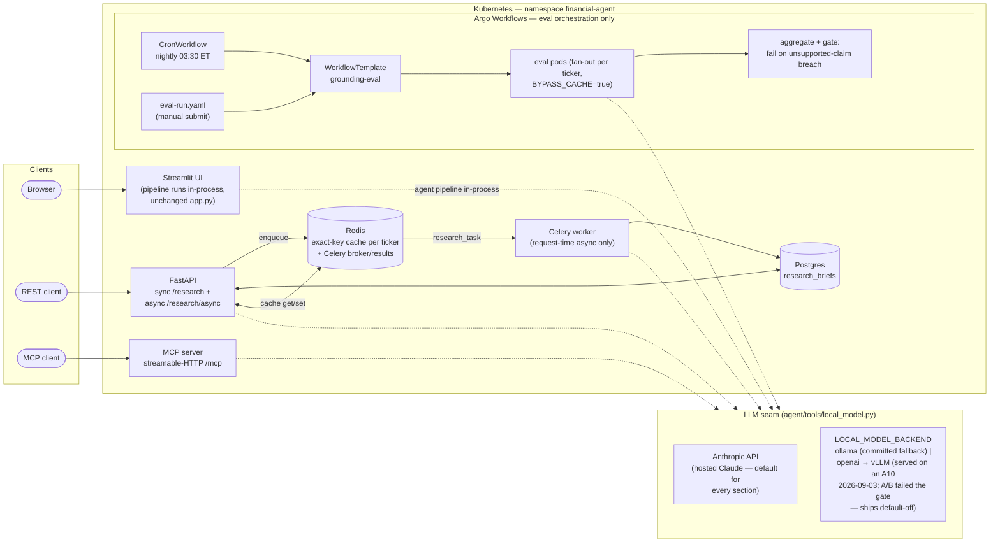

# Architecture

Six services plus an eval plane, deployed as one topology on Kubernetes
(kind locally; OKE is the Phase 2 target of the OCI migration). Per the
Phase 0 audit, K8s is the **first environment where the full designed
topology runs** — the retired ECS deployment (infra/) was a single FastAPI
container + RDS, with no Celery, Redis, Streamlit, or MCP in production.

## Reading the diagram

- **Four pods embed the same agent pipeline** (one image, four commands —
  see Dockerfile.k8s). Streamlit deliberately runs the pipeline in-process
  (no Streamlit→FastAPI hop); the MCP server calls the agent tools directly.
- **Celery vs Argo is a hard boundary.** Celery handles request-time async
  (`POST /research/async` → Redis broker → worker); Argo owns batch/eval
  orchestration. They are never merged (CLAUDE.md constraint 4).
- **The Redis cache is an exact-key cache** — key `research:{TICKER}`,
  24h TTL. It is not a semantic cache. Redis is PVC-less on purpose, on
  every deploy target (kind and OKE alike): the cache is rebuildable and
  Celery results are short-lived, so a restart costs only a cold cache.
- **The LLM seam**: hosted Claude serves everything by default. With
  `USE_LOCAL_MODEL=true`, only the two sections the fine-tuned
  Qwen2.5-1.5B was trained on (Financial Health, Risk Factors) route to
  `LOCAL_MODEL_URL`; `LOCAL_MODEL_BACKEND` selects the protocol —
  `ollama` (the committed fallback) or `openai` (what vLLM serves). vLLM
  served the fine-tune on an A10 (plain Docker 2026-09-02, in-cluster
  k3s 2026-09-03), and the eval DAG then measured it: **12.31%
  unsupported vs a same-day 3.03% hosted baseline (judge v1) — the fine-tune fails
  the 5% gate on the two sections it owns** (same harness, same day;
  dated A/B in eval-methodology.md). `USE_LOCAL_MODEL` ships off as a
  measured negative result. OKE serving remains Phase 2.
- **Default-off features**: cross-encoder reranking and the multi-agent
  supervisor ship default-off because evals showed no grounding gain at
  higher cost/latency (docs/PHASE0_AUDIT.md).
- **Eval pods bypass the cache** (`BYPASS_CACHE=true`) and gate the
  workflow on the unsupported-claim rate — see
  [eval-methodology.md](eval-methodology.md).

## Deploy targets

Manifests are kustomize base + overlays (k8s/, k8s/vllm/, argo/): the kind
overlays reproduce the single-node local cluster exactly (proof:
[verification.md](verification.md)); the oke overlays add OCIR images,
OCI LoadBalancers, Block Volume PVCs, and the A10 GPU scheduling for vLLM.
See [deploy-runbook.md](deploy-runbook.md).
