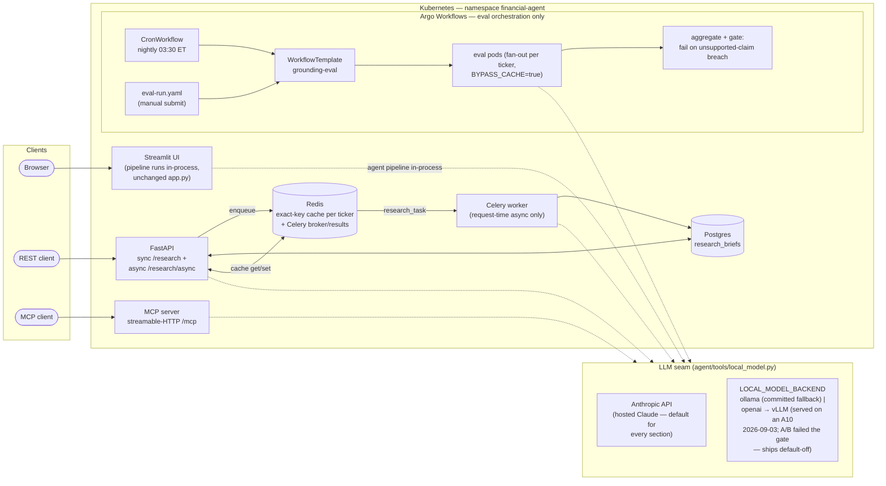
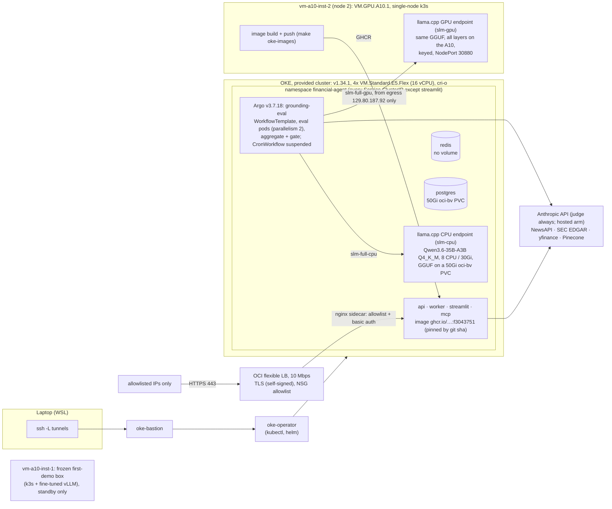

# Architecture

Six services plus an eval plane, deployed as one topology on Kubernetes
(kind locally; on OCI, a provided OKE cluster plus an A10 node — see
"Deployed topology (October 2026)" below; the Terraform OKE cluster is
still the Phase 2 target of the OCI migration). Per the
Phase 0 audit, K8s is the **first environment where the full designed
topology runs** — the retired ECS deployment (infra/) was a single FastAPI
container + RDS, with no Celery, Redis, Streamlit, or MCP in production.

```mermaid
flowchart LR
    subgraph clients [Clients]
        browser([Browser])
        rest([REST client])
        mcpc([MCP client])
    end

    subgraph cluster ["Kubernetes — namespace financial-agent"]
        streamlit["Streamlit UI<br/>(pipeline runs in-process,<br/>unchanged app.py)"]
        api["FastAPI<br/>sync /research +<br/>async /research/async"]
        worker["Celery worker<br/>(request-time async only)"]
        redis[("Redis<br/>exact-key cache per ticker<br/>+ Celery broker/results")]
        pg[("Postgres<br/>research_briefs")]
        mcp["MCP server<br/>streamable-HTTP /mcp"]

        subgraph argo ["Argo Workflows — eval orchestration only"]
            cron["CronWorkflow<br/>nightly 03:30 ET"] --> wft["WorkflowTemplate<br/>grounding-eval"]
            evalrun["eval-run.yaml<br/>(manual submit)"] --> wft
            wft --> pods["eval pods (fan-out per ticker,<br/>BYPASS_CACHE=true)"]
            pods --> gate["aggregate + gate:<br/>fail on unsupported-claim breach"]
        end
    end

    subgraph llm ["LLM seam (agent/tools/local_model.py)"]
        hosted["Anthropic API<br/>(hosted Claude — default for<br/>every section)"]
        local["LOCAL_MODEL_BACKEND<br/>ollama (committed fallback) |<br/>openai → vLLM (served on an A10<br/>2026-09-03; A/B failed the gate<br/>— ships default-off)"]
    end

    browser --> streamlit
    rest --> api
    mcpc --> mcp
    api -->|enqueue| redis
    redis -->|research_task| worker
    api <--> pg
    worker --> pg
    api <-->|cache get/set| redis
    streamlit -.->|agent pipeline in-process| llm
    api -.-> llm
    worker -.-> llm
    mcp -.-> llm
    pods -.-> llm
```

## Reading the diagram

- **Four pods embed the same agent pipeline** (one image, four commands —
  see Dockerfile.k8s). Streamlit deliberately runs the pipeline in-process
  (no Streamlit→FastAPI hop); the MCP server calls the agent tools directly.
- **Celery vs Argo is a hard boundary.** Celery handles request-time async
  (`POST /research/async` → Redis broker → worker); Argo owns batch/eval
  orchestration. They are never merged (CLAUDE.md constraint 4).
- **The Redis cache is an exact-key cache** — key `research:{TICKER}`,
  24h TTL. It is not a semantic cache. Redis is PVC-less on purpose, on
  every deploy target (kind and OKE alike): the cache is rebuildable and
  Celery results are short-lived, so a restart costs only a cold cache.
- **The LLM seam**: hosted Claude serves everything by default. With
  `USE_LOCAL_MODEL=true`, only the two sections the fine-tuned
  Qwen2.5-1.5B was trained on (Financial Health, Risk Factors) route to
  `LOCAL_MODEL_URL`; `LOCAL_MODEL_BACKEND` selects the protocol —
  `ollama` (the committed fallback) or `openai` (what vLLM serves). vLLM
  served the fine-tune on an A10 (plain Docker 2026-09-02, in-cluster
  k3s 2026-09-03), and the eval DAG then measured it: **12.31%
  unsupported vs a same-day 3.03% hosted baseline (judge v1) — the fine-tune fails
  the 5% gate on the two sections it owns** (same harness, same day;
  dated A/B in eval-methodology.md). `USE_LOCAL_MODEL` ships off as a
  measured negative result. OKE serving remains Phase 2.
- **The SLM seam** (`agent/tools/slm.py`): with `SLM_FULL=true` every
  agent LLM call — the four sections, the synthesis and the RAG answers —
  goes to one OpenAI-compatible llama.cpp endpoint (`SLM_ENDPOINT=cpu` or
  `gpu`), with no hosted fallback; the judge stays hosted. The eval's
  `slm-full-cpu` and `slm-full-gpu` arms set it per run; the app ships
  with it off. Measured against hosted on the same image: eval-methodology,
  "GPU SLM extended run `p9jr2`".
- **Default-off features**: cross-encoder reranking and the multi-agent
  supervisor ship default-off because evals showed no grounding gain at
  higher cost/latency (docs/PHASE0_AUDIT.md).
- **Eval pods bypass the cache** (`BYPASS_CACHE=true`) and gate the
  workflow on the unsupported-claim rate — see
  [eval-methodology.md](eval-methodology.md).

## Deployed topology (October 2026)

This is where the system runs for the November demo. It is the single
statement of the deployed topology; the README and CLAUDE.md point here.

```mermaid
flowchart LR
    subgraph laptop ["Laptop (WSL)"]
        ssh["ssh -L tunnels"]
    end
    bastion["oke-bastion"] --> operator["oke-operator<br/>(kubectl, helm)"]
    ssh --> bastion

    subgraph oke ["OKE, provided cluster: v1.34.1, 4x VM.Standard.E5.Flex (16 vCPU), cri-o"]
        subgraph ns ["namespace financial-agent (every Service ClusterIP except streamlit)"]
            app["api · worker · streamlit · mcp<br/>image ghcr.io/…:f3043751 (pinned by git sha)"]
            redis[("redis<br/>no volume")]
            pg[("postgres<br/>50Gi oci-bv PVC")]
            argo["Argo v3.7.18: grounding-eval<br/>WorkflowTemplate, eval pods (parallelism 2),<br/>aggregate + gate; CronWorkflow suspended"]
            cpu["llama.cpp CPU endpoint (slm-cpu)<br/>Qwen3.6-35B-A3B Q4_K_M, 8 CPU / 30Gi,<br/>GGUF on a 50Gi oci-bv PVC"]
        end
    end
    operator --> oke
    viewers["allowlisted IPs only"] -->|"HTTPS 443"| lb["OCI flexible LB, 10 Mbps<br/>TLS (self-signed), NSG allowlist"]
    lb -->|"nginx sidecar: allowlist + basic auth"| app

    subgraph node2 ["vm-a10-inst-2 (node 2): VM.GPU.A10.1, single-node k3s"]
        gpu["llama.cpp GPU endpoint (slm-gpu)<br/>same GGUF, all layers on the A10,<br/>keyed, NodePort 30880"]
        build["image build + push (make oke-images)"]
    end
    node1["vm-a10-inst-1: frozen first-demo box<br/>(k3s + fine-tuned vLLM), standby only"]

    ext["Anthropic API (judge always; hosted arm)<br/>NewsAPI · SEC EDGAR · yfinance · Pinecone"]
    argo -->|"slm-full-cpu"| cpu
    argo -->|"slm-full-gpu, from egress 129.80.187.92 only"| gpu
    argo --> ext
    app --> ext
    build -->|"GHCR"| app
```

**The provided OKE cluster** (provisioned for the project, not by
`terraform/oci`; overlays `k8s/overlays/oke-provided`,
`argo/overlays/oke-provided`, `k8s/llamacpp/overlays/oke-cpu`):

- OKE v1.34.1, four VM.Standard.E5.Flex amd64 nodes at 16 vCPU (8 OCPU)
  each, two with ~28 GiB and two with ~58 GiB allocatable; no GPUs; cri-o,
  so every image comes from a registry; default StorageClass `oci-bv`.
- The app plane: api, worker, streamlit and mcp from one image on GHCR,
  pinned by git sha (`f3043751` since 2026-10-06; `1f51dad` for the runs
  before it), Redis without a volume, Postgres on a 50Gi `oci-bv` PVC.
- Argo Workflows v3.7.18 with the grounding-eval WorkflowTemplate: one eval
  pod per ticker at parallelism 2, then the aggregate and its gate. The
  nightly CronWorkflow is suspended; runs are submitted from the operator
  (`make eval-run`, `make slm-eval-run` with the traffic proof). The
  controller may create ConfigMaps in the namespace for oversized templates
  (eval-methodology, "template offload").
- The CPU SLM endpoint: llama.cpp b11347 serving Qwen3.6-35B-A3B Q4_K_M,
  8 CPU / 30Gi requested and limited, so it lands on a ~58 GiB node; the
  GGUF sits on a 50Gi `oci-bv` PVC. Keyed; reached only in-cluster.
- Access: every Service is ClusterIP except Streamlit's — no NodePort,
  and the API, Argo, MCP and the CPU endpoint are not public. The operator
  host (kubectl, helm) is reached by ssh through `oke-bastion`; Argo and
  anything else a person looks at is a `kubectl port-forward` behind
  `ssh -L`.
- **What is public** (requested by the tenancy owner; overlay
  `k8s/overlays/oke-provided-public-ui`): the Streamlit UI only, through one
  OCI flexible load balancer (10 Mbps) on subnet `pub_lb-tbhcuw`, HTTPS on
  443 with a self-signed certificate. **To whom:** the IPv4 addresses on a
  gitignored allowlist (the project owner's and the tenancy owner's network
  today; reviewers are added on request). **How it is protected:** the
  allowlist is enforced twice — in a front-end NSG the cloud controller
  manages from `loadBalancerSourceRanges`, and again in an nginx sidecar on
  the client address — then basic auth in nginx (the password lives only on
  the operator). Every uncached brief spends Anthropic credit; the hard cap
  is the Anthropic workspace's monthly spend limit. Runbook: "Public
  Streamlit UI".

**vm-a10-inst-2 (node 2)**: VM.GPU.A10.1 (1× A10 24 GB, Ubuntu 22.04),
single-node k3s.

- The GPU SLM endpoint: llama.cpp b11347 (CUDA build) serving the same
  GGUF with all layers on the A10 (alias `qwen3.6-35b-a3b-q4km`, never
  hybrid), keyed, on NodePort 30880. The VCN security list admits 30880
  from the OKE cluster's egress IP (129.80.187.92/32) only; ufw repeats
  the rule. Without the key it answers 401.
- The financial-lora vLLM deployment is scaled to 0 with no Service while
  the GPU endpoint holds the A10 (`make vm-llamacpp`); `make vm-vllm`
  swaps it back.
- Node 2 also builds and pushes the app image (`make oke-images`). Its
  September k3s app plane (NodePorts 30080/30501, no auth) was still
  deployed as of 2026-10-03 and is not part of the demo path; port 22 is the only other
  port the security list admits.

**vm-a10-inst-1**: the frozen box from the first demo — single-node k3s
with the fine-tuned model on vLLM. Standby and fallback only for the demo.

**kind** (laptop): the local equivalence baseline every overlay change is
proven against (`scripts/render_diff.py`, [verification.md](verification.md)).

**External services**: the Anthropic API (the grounding judge on every
arm; the hosted arm's sections, synthesis and RAG answers), NewsAPI, SEC
EDGAR, yfinance (it has answered 429 from the OKE egress IP; every run's
aggregate counts empty stock blocks), Pinecone (the SEC filing index), GHCR.

**What does not exist**: the Terraform OKE cluster in `terraform/oci/`
(never applied), OCIR, the Object Storage bucket, and any vLLM serving on
OKE. The OKE Phase 2 plan (the Goal section of CLAUDE.md) is unchanged and
still waits on a compartment.

**Where the measured arms ran** (all on image `1f51dad`):

| Arm | Model served from | Harness |
|---|---|---|
| hosted (`9jzmj`) | Anthropic API | OKE eval pods |
| slm-full-cpu (`8vpq6`) | llama.cpp CPU endpoint, OKE | OKE eval pods |
| slm-full-gpu (`p9jr2`) | llama.cpp GPU endpoint, node 2 | OKE eval pods, over 30880 |

## Deploy targets

Manifests are kustomize base + overlays (k8s/, k8s/vllm/, argo/): the kind
overlays reproduce the single-node local cluster exactly (proof:
[verification.md](verification.md)); the oke overlays add OCIR images,
OCI LoadBalancers, Block Volume PVCs, and the A10 GPU scheduling for vLLM.
See [deploy-runbook.md](deploy-runbook.md).
